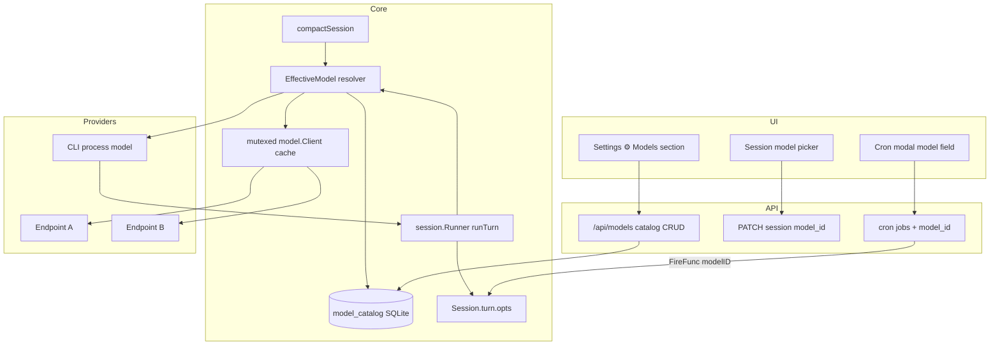
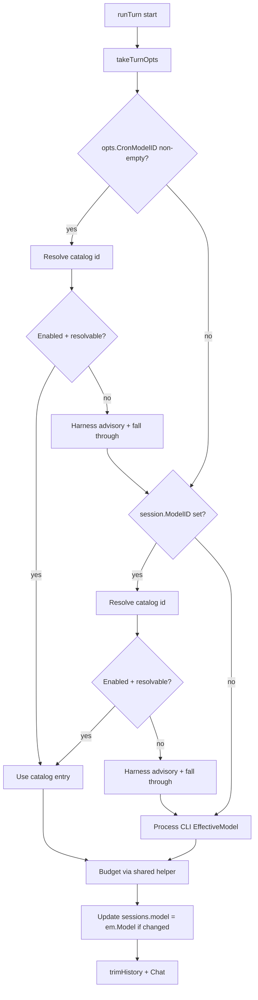

# ADR-0018: Selectable Models (Settings Catalog + Per-Session + Cron)

| Field | Value |
|-------|--------|
| **Status** | Accepted (ready to implement) |
| **Date** | 2026-07-25 |
| **Author** | — |
| **Deciders** | Project owner |
| **Tags** | model, catalog, settings, session, cron, budget, multi-endpoint |
| **Extends** | ADR-0001 (inner loop / model client), ADR-0003 (SQLite schema), ADR-0007 (Settings UI), ADR-0008 (session info), ADR-0015 (cron jobs), ADR-0016 (API key auth) |
| **Supersedes (partial)** | ADR-0016 Q8 deferred multi-provider key map — **only for catalog entries** (per-entry `api_key_env` + base URL). Process CLI remains single `--api-key-env`. |
| **Answers** | `adr/0018-answers.json` (`2026-07-25T11:28:57.601Z`) |

## Overview

Marble today binds the entire harness to a **single** OpenAI-compatible model configured at launch (`--base-url`, `--model`, `--context-limit`, `--max-output`, `--context-reserve`, `--api-key-env`). Every session turn, compact path, health probe, and Settings “Runtime” panel uses that one process-wide `model.Client` and `config.Config` budget.

Operators need a **catalog of models** they can manage from Settings, **select per chat session** for the next turn, and **optionally pin on cron jobs**—while the CLI-launched model remains a permanent **failsafe fallback**. Mid-session switches must recompute context budgets against the **active** model’s limits and degrade gracefully when capabilities differ (e.g. smaller context window, no image support later).

This ADR proposes: a durable **model catalog** (SQLite), an **effective-model resolver** (cron pin → session override → process fallback) with **normative turn-option plumbing** from cron fire into `runTurn`, multi-endpoint **client construction** with env-only secrets (expanding ADR-0016’s deferred multi-key map for catalog rows only), dual-field session persistence (`model_id` vs `model`), Settings + session + cron UI/API surfaces, and loop integration so `trimHistory`, usage ratios, and compact always use active limits.

## Background & Motivation

### Current state (verified)

| Area | Today |
|------|--------|
| Config | Single `Config.Model`, `BaseURL`, `ContextLimit`, `MaxOutput`, `ContextReserve`, `Budget()` in [`internal/config/config.go`](internal/config/config.go) |
| Client | One `*model.Client` in `main` → `session.Runner.Client`; `Chat` always sends `c.Model` ([`internal/model/client.go`](internal/model/client.go)) |
| Loop | `budget := r.Cfg.Budget()`; `trimHistory(hist, budget, toolEst)`; `r.Client.Chat` ([`internal/session/loop.go`](internal/session/loop.go)). `PostCron` / `postMessage` → `go r.runTurn(s)` with **no turn options** |
| Turn state | `turnControl` holds cancel + progress only ([`internal/session/turn.go`](internal/session/turn.go)) |
| Compact | `compactSession` uses process client; middle-history prompt is **not** budget-trimmed before Chat ([`loop.go`](internal/session/loop.go) ~490+) |
| Session row | `sessions.model` stores **process** model name via `Registry.model` on every `syncSessionRow` ([`internal/session/persist.go`](internal/session/persist.go)); MD frontmatter `model:` same ([`internal/memory/session_md.go`](internal/memory/session_md.go)) |
| Events | `session_events.model` + `meta_json` columns exist ([`internal/db/events.go`](internal/db/events.go)); `logEvent` always sets `Model: r.model` and **never** sets `MetaJSON` ([`persist.go`](internal/session/persist.go) ~39–66) |
| Settings | Runtime model/base URL/auth **read-only CLI** (ADR-0007 / 0016); [`internal/api/settings.go`](internal/api/settings.go), [`internal/web/static/settings.js`](internal/web/static/settings.js) |
| Cron | Jobs: prompt + session_id, **no model**; `FireFunc(jobID, jobName, sessionID, prompt string)` ([`internal/cron/manager.go`](internal/cron/manager.go), [`internal/db/cron.go`](internal/db/cron.go)) |
| Schema | `CurrentSchemaVersion = 2` (v2 = cron); stepwise upgrade; **failed migrate aborts `Open`** (not limp) ([`internal/db/db.go`](internal/db/db.go)) |
| Wire | `model.Message.Content` is **string** (text-only); `attach_file` is UI-only, not re-injected into model history |
| Busy HTTP | Message post / stop already return **409** when busy ([`internal/api/server.go`](internal/api/server.go)) |

### Pain points

1. Switching providers or model sizes requires **restart** with new CLI flags.  
2. Operators cannot use a cheap/fast model for cron hygiene and a large-context model for coding in the same harness.  
3. Context usage % and auto-compact thresholds are meaningless if the session “thinks” it still has the process window after the operator intended a smaller model.  
4. Cost metadata has nowhere to live for a future spend ADR.

## Goals & Non-Goals

### Goals

1. **Process CLI model is always the failsafe fallback** (default when nothing selected; recovery when catalog entry missing/disabled/unhealthy).  
2. **Catalog of extra models** editable in Settings ⚙ (extending ADR-0007), with identity, endpoint, auth-env, costs, capabilities, context limits, enabled/sort/notes.  
3. **Per-session model selection** for the next turn (UI picker + API).  
4. **Mid-session switch** recomputes budget/trim/compact against the **active** model; unsupported content stripped when caps known, else clear harness error.  
5. **Cron** optional `model_id` on create/update/fire (tools + UI + HTTP), plumbed into the turn goroutine.  
6. **Store cost fields now**; session cost tracking deferred.  
7. Secrets remain **env-only** (ADR-0016); catalog stores env var **names**, never key material. Never write resolved keys to SQLite.  
8. Observability: which model ran a turn (`session_events.model` + `meta_json`); health for process + (on demand) catalog entries.

### Non-goals (v1)

| Non-goal | Rationale |
|----------|-----------|
| Session cost tracking / spend dashboards | Future ADR; store prices only |
| Multi-agent multi-model routing / automatic model selection by task | Operator/explicit selection only |
| Streaming token accounting | Unchanged non-streaming Chat path |
| Multimodal wire (image/voice parts) | Design caps flags only; Content stays string until a later ADR |
| Literal API keys in Settings/DB/CLI | ADR-0016 stands |
| Hot-reload of process CLI flags without restart | Catalog is the hot path; process remains launch-time |
| Provider-specific non-OpenAI protocols | Still OpenAI-compatible Chat Completions |

## Key Decisions

| # | Decision | Rationale |
|---|----------|-----------|
| **KD1** | Catalog stored in **SQLite** table `model_catalog` (schema **v3**), not a JSON file | Matches cron durability pattern; transactional CRUD; limp-aware; no second config file format. Process fallback is **not** a row—always synthesized from CLI. |
| **KD2** | **Multiple base URLs / providers in v1** via optional per-entry `base_url` + `api_key_env` (inherit process when empty) | Operators mix local vLLM + hosted gateways; still one wire protocol. **Partially supersedes** ADR-0016 Q8 (multi-key map) for catalog only; process CLI stays single `--api-key-env`. |
| **KD3** | **Effective model resolution (per turn):** (1) **cron fire pin** if turn opts carry `CronModelID`; (2) **session `model_id`** if set and enabled; (3) **process CLI fallback** | Cron pin is intentional for scheduled work; session override for interactive; process always last-resort. Pin does **not** rewrite session preference. |
| **KD4** | New sessions default to **no catalog override** (empty `model_id` → process). Cron jobs default **unset** | Predictable; no silent binding to a slug that may be deleted. |
| **KD5** | `session.Runner` resolves a **turn-scoped** `EffectiveModel` at the start of `runTurn` (and compact) instead of always using `r.Cfg` / single `r.Client` | Minimal pivot: loop/budget/usage/compact read active limits; clients from cache. |
| **KD6** | On switch to smaller context: **no durable history rewrite on PATCH**; next turn uses active budget for trim + auto-compact. Auto-compact cascade after shrink is **intentional**. **In-turn compact** (auto-compact and `session_compact` tool) always uses the **current turn’s already-resolved `em`** (including cron pin)—never re-resolves interactive-only. Compact source text is trimmed to **80% of `em.Budget()`** before summary Chat | Transcript remains source of truth until compact runs; compact budget/client must match the turn’s Chat so a small pin cannot re-inflate via a larger session/process window. |
| **KD7** | Capabilities: structured flags. **`cap_tools=false` → omit tools array** from Chat + one harness advisory. Image/voice strip when known (no-op while text-only). Provider errors → harness message | Operator-flagged tools=false must be honored; such models are unsuitable for normal Marble agent turns. |
| **KD8** | Agent **may** list catalog + set/clear session model via tools; **may not** invent catalog entries or read secrets | Symmetric with cron tools; operator owns catalog via Settings. |
| **KD9** | Health: process model remains `/api/health` `model_ok`; catalog entries **on-demand** only | Avoid multi-second health endpoints. |
| **KD10** | Auth per entry: `api_key_env` string (comma-list, ADR-0016 resolve); empty = inherit process; `"none"` = omit Authorization. Named env all empty → **no Authorization** + advisory (same as process WARN), never fall back to process key | Covers local open endpoints beside cloud keys without storing secrets. |
| **KD11** | **Turn options lifetime:** cron pin and other turn-scoped fields live on `Session.turn` (or `pendingTurnOpts`) set in `postMessage`/`PostCron`, read once at `runTurn` start, cleared in `endTurn`. Interactive / continuation paths pass empty `CronModelID` | Makes KD3 implementable without globals or races across concurrent sessions. |
| **KD12** | **Dual field contract:** `model_id` = durable catalog slug (or `""`); `model` / MD `model:` / `sessions.model` = **last effective provider model string** (updated on successful resolve for a turn or on PATCH). API also exposes resolved `model_effective` object for limits/display | Avoids overloading one column; session-info and list stay readable. |

## Proposed Design

### Architecture



### Turn options plumbing (normative — KD11)

Today the fire path cannot carry a model pin:

```text
cron.fireJob → FireFunc(jobID, jobName, sessionID, prompt)
  → runner.PostCron(s, prompt)
  → postMessage(s, text, true, nil)
  → go r.runTurn(s)   // no options
```

**Target plumbing:**

```go
// internal/cron
type FireFunc func(jobID, jobName, sessionID, prompt, modelID string) FireResult

// internal/session
type TurnOpts struct {
    CronModelID string // empty for interactive / continuation
    // reserved for future turn-scoped flags
}

// turnControl (or Session fields under same mutex as turn)
//   opts TurnOpts  — set before go runTurn; read at start of runTurn; zeroed in endTurn

func (r *Runner) PostUserMessage(s *Session, text string, actor *Actor) bool {
    return r.postMessage(s, text, false, actor, TurnOpts{})
}
func (r *Runner) PostContinuation(s *Session, text string) bool {
    // …prefix…
    return r.postMessage(s, text, true, nil, TurnOpts{})
}
func (r *Runner) PostCron(s *Session, text, modelID string) bool {
    return r.postMessage(s, text, true, nil, TurnOpts{CronModelID: strings.TrimSpace(modelID)})
}

func (r *Runner) postMessage(s *Session, text string, continuation bool, actor *Actor, opts TurnOpts) bool {
    if !s.tryBeginTurn() { return false }
    s.setTurnOpts(opts) // stored on turnControl; cleared in endTurn
    // … append UI + history …
    go r.runTurn(s)
    return true
}

func (r *Runner) runTurn(s *Session) {
    defer func() { s.endTurn() /* clears opts + busy */ ; … }()
    opts := s.takeTurnOpts() // copy once at start
    em := r.resolveEffective(s, opts)
    // … budget, trim, Chat via clientFor(em) …
}
```

**`main` FireFunc adapter** (extends ADR-0015 wiring):

```go
cronMgr := cron.New(sqldb, func(jobID, jobName, sessionID, prompt, modelID string) cron.FireResult {
    // … load/create session …
    if !runner.PostCron(s, prefixedPrompt, modelID) {
        return cron.FireResult{Status: "skipped_busy", …}
    }
    return cron.FireResult{Status: "ok", SessionID: s.ID, …}
}, …)
```

`fireJob` / Run-now paths pass `job.ModelID` into `FireFunc`. Interactive UI and `schedule_continuation` never set `CronModelID`.

```mermaid
sequenceDiagram
  participant Cron as cron.Manager
  participant Main as FireFunc adapter
  participant Runner as session.Runner
  participant Sess as Session.turn
  participant Loop as runTurn

  Cron->>Main: fire(jobID, name, sessionID, prompt, modelID)
  Main->>Runner: PostCron(s, prompt, modelID)
  Runner->>Sess: setTurnOpts(CronModelID=modelID)
  Runner->>Loop: go runTurn(s)
  Loop->>Sess: takeTurnOpts()
  Loop->>Loop: resolveEffective(s, opts)
  Loop->>Loop: Chat with em client/budget
  Loop->>Sess: endTurn() clears opts
```

### Effective model resolution



**Resolution order (normative):**

| Priority | Source | When applied |
|----------|--------|----------------|
| 1 | `opts.CronModelID` | Turns started by that job’s fire (including Run now) |
| 2 | `session.ModelID` | Interactive / continuation; also cron if pin empty or pin failed |
| 3 | Process CLI | Always available failsafe |

If a selected id is **missing, disabled, or unresolvable**: emit harness advisory, fall through to next priority, ultimately process CLI.

**Cron pin does not permanently rewrite `session.ModelID`.** The fire uses the pin for that turn’s Chat/budget only.

### Dual-field session semantics (KD12)

| Field | Storage | Meaning |
|-------|---------|---------|
| `model_id` | `sessions.model_id`, MD `model_id:`, `Session.ModelID` | Catalog slug override; `""` = none (process default for interactive resolve) |
| `model` | `sessions.model`, MD `model:`, historically process name | **Last effective provider model string** (e.g. `Qwen/…` or `gpt-4o-mini`) after resolve for a completed turn start, or immediately on PATCH when the chosen entry resolves |

**Rules:**

1. On `syncSessionRow` / MD encode: write both `ModelID` and `Model` from the live `Session`.  
2. On session create: `ModelID=""`, `Model=process model string` (same as today).  
3. On successful `resolveEffective` at turn start: if `em.Model` ≠ `s.Model`, set `s.Model = em.Model` and mark dirty (so list/info reflect last used provider id).  
4. On PATCH `model_id`: set `Session.ModelID`; resolve once (without starting a turn) to set `Model` to that entry’s provider string (or process if clearing / fallback); publish `session_meta` event.  
5. API `model_effective` (computed, not a DB column): full public effective snapshot (display_name, catalog_id, source, limits, budget, caps) for the **interactive** resolve path (session → process; **ignore** cron pin so idle UI matches picker).

Info / list badges:

- Prefer showing `model_id` badge when set (display name from catalog if known).  
- `model` field remains the provider string for diagnostics (ADR-0008 `InfoSession.Model`).

### Turn loop integration

Today ([`internal/session/loop.go`](internal/session/loop.go)):

```go
budget := r.Cfg.Budget()
prompt := trimHistory(hist, budget, toolEst)
result, err := r.Client.Chat(ctx, prompt, toolSpecs)
```

Proposed:

```go
opts := s.takeTurnOpts()
em := r.resolveEffective(s, opts)
budget := em.Budget() // shared helper, floor 1024
// capture em for GetUsage closure and all Chat sites this turn
toolSpecs := r.Tools.Specs()
if !em.Caps.Tools {
    toolSpecs = nil
    r.advisory(s, "[harness] model cap_tools=false — tools omitted for this turn")
}
// …
prompt := trimHistory(hist, budget, toolEst)
prompt = applyCapabilityFilter(prompt, em.Caps) // pure; no-op for text-only today
client := r.clientFor(em)
result, err := client.Chat(ctx, prompt, toolSpecs)
r.Reg.logModelCall(s, em, …) // see Event logging
```

**Shared budget helper** (package `config` or `model`):

```go
func BudgetTokens(contextLimit, maxOutput, contextReserve int) int {
    b := contextLimit - maxOutput - contextReserve
    if b < 1024 {
        return 1024
    }
    return b
}
func UsageRatio(estPrompt, budget int) float64 { … }
```

`Config.Budget()` becomes a thin wrapper; `EffectiveModel.Budget()` uses the same helper.

`usageSnapshot` / `get_context_usage` / context warn & auto-compact ratios use **`em` limits** for this turn (closure captures the turn’s `em`—**never** re-resolve interactive-only while a turn is active).

### In-turn compact uses turn `em` (normative)

Auto-compact and the `session_compact` tool both run **inside** an active turn (there is no idle out-of-band compact path today). They **must not** call `resolveEffective(target, TurnOpts{})`.

```go
// At runTurn start, after opts := takeTurnOpts(); em := resolveEffective(s, opts):
tc := &tools.TurnContext{
    // …
    Compact: func(style string, keepLast int) (string, error) {
        return r.compactSession(ctx, s, style, keepLast, em) // capture turn em (cron pin included)
    },
    GetUsage: func() map[string]interface{} {
        return r.usageSnapshot(s, toolEst, lastReportedIn, lastReportedOut, em)
    },
}
// Auto-compact path in the loop:
if highUsageStreak >= r.Cfg.ContextAutoCompactRounds {
    _, err := r.compactSession(ctx, s, "auto", 12, em)
    // re-trim with same em.Budget()
}

// Signature
func (r *Runner) compactSession(ctx context.Context, target *Session, style string, keepLast int, em EffectiveModel) (string, error)
```

**Rules:**

1. **Pass the turn’s already-resolved `em`** into every `compactSession` / `TurnContext.Compact` invocation for that turn (includes cron pin when present).  
2. **Source trim:** truncate middle-history source text to **80% of `em.Budget()`** (token estimate) before building the summary user message. Fixed fraction avoids under-spec “approximately.”  
3. Summary **`Chat` uses `clientFor(em)` and `em.MaxOutput`** — same client/limits as the turn’s agent Chat.  
4. System compact child session may still be titled/created as today; its **Chat** uses the passed `em`, not a fresh interactive resolve.  
5. Do **not** invent a separate “compact model” or fall back to process for summary while the turn is pinned smaller.

### Mid-session model switch

1. Operator (or agent tool) sets `session.model_id` via API while session **not busy** → **409** if busy (`session.IsBusy` / existing busy pattern).  
2. **Closed sessions:** reject PATCH with **400** (or 409); model selection is only for active sessions. Clearing is not special-cased.  
3. Persist dual fields (KD12) to SQLite + MD (`session_md` encode/decode `model_id` + `model`).  
4. Publish SSE `session_meta` (see below).  
5. **Next turn:** new budget; `trimHistory` may drop more of history if window shrinks.  
6. Durable history is **not** rewritten on PATCH alone.  
7. **Expected cascade (intentional, KD6):** if estimated history ≫ new budget, the next turn’s first usage ratio will often be ≥ 0.85 immediately → **auto-compact after `ContextAutoCompactRounds` consecutive high rounds** (default 3) rewrites middle history via `compactSession`. This is desired recovery, not a bug.  
8. **Switch-time advisory (normative):** on PATCH, if `estimateAll(history)+toolEst > em.Budget()`, publish harness advisory:  
   `"[harness] selected model budget is smaller than current history estimate; next turn will trim and may auto-compact. Prefer session_compact now."`  
   v1 does **not** auto-run compact on PATCH (avoids surprise rewrite while idle); operator/agent may compact proactively.  
9. If switch target is disabled/deleted between select and turn: fall through per resolver + advisory.

### Capability / unsupported content

| Situation | Behavior |
|-----------|----------|
| Text-only transcript (today) | No change |
| Future image parts + `cap_images=false` | **Strip** image parts from **outbound** prompt only; harness advisory once per turn |
| Unknown failure (provider rejects content) | Surface model HTTP error as today + suggest switching model |
| **`cap_tools=false` (locked)** | **Omit** `tools` / `tool_choice` from Chat request; inject one harness advisory; do not execute a tool loop that cannot start |

Settings helper text: “Disable tools only for non-agent / completion-only endpoints. Normal Marble sessions need tools.”

`applyCapabilityFilter(messages, caps)` is a **pure function** with unit tests: identity/no-op on today’s string-only messages; structured-part strip when multimodal lands later. Keep out of the main PR3 review surface if stubbed.

### Client construction & cache

```go
type EffectiveModel struct {
    Source         string // "process" | "catalog"
    CatalogID      string // empty if process
    DisplayName    string
    Model          string // provider model id
    BaseURL        string
    APIKey         string // resolved secret; never log / never JSON
    APIKeyEnvUsed  string
    ContextLimit   int
    MaxOutput      int
    ContextReserve int
    Caps           Capabilities
    Cost           CostMeta
}

func (e EffectiveModel) Budget() int {
    return BudgetTokens(e.ContextLimit, e.MaxOutput, e.ContextReserve)
}
```

**Cache (normative):**

| Rule | Detail |
|------|--------|
| Key | `(baseURL, model, maxOutput, apiKeyFingerprint)` where fingerprint is `apiKeyEnvUsed` or `"none"` — **not** the secret. Optionally include catalog `updated_at` or a monotonic generation. |
| Concurrency | `sync.Mutex` around map get-or-create (prefer over bare `sync.Map` for multi-field updates). Safe under MaxConcurrentFires=3 + interactive. |
| Process client | The `main`-built `*model.Client` is **not** stored in the catalog cache; `clientFor(process EM)` returns `r.Client` / process pointer. |
| Invalidation | On catalog **PUT/DELETE**: drop all cache entries whose key matches that entry’s baseURL/model (or wipe entire cache — max 32, cheap). On harness restart: empty. |
| Stale MaxTokens | After catalog changes `max_output`, invalidation ensures next `clientFor` builds a new client with correct `MaxTokens`. |

### Process fallback synthesis

Always available, not stored in `model_catalog`:

| Field | From |
|-------|------|
| Model | `--model` |
| BaseURL | `--base-url` |
| Limits | `--context-limit`, `--max-output`, `--context-reserve` |
| Auth | resolved `--api-key-env` |
| Caps | `tools=true`, `images=false`, `voice=false`, `reasoning=false` (conservative until multimodal) |
| Display | `Process default (CLI)` |

Settings Runtime section continues to show CLI process fields **read-only**. Catalog is a new editable section.

### Inheritance rules (limits & auth)

| Catalog field | Empty / 0 meaning |
|---------------|-------------------|
| `base_url` | Inherit process `--base-url` |
| `api_key_env` | Inherit process key resolution |
| `api_key_env = "none"` | Force no Authorization |
| `api_key_env = "NAME,…"` | Resolve those names only; if all empty → no Authorization + advisory (**do not** fall back to process key) |
| **`context_reserve = 0`** | **Inherit process `Cfg.ContextReserve`** (operator CLI, default 8192). Only values **> 0** override. |
| `context_limit` / `max_output` | Required > 0 on catalog rows (no inherit) |

## Data Model Changes

### Schema v3 migration

`CurrentSchemaVersion = 3`.

```sql
-- migrateV2toV3 (single transaction; failure → Open returns error, process exits)
CREATE TABLE IF NOT EXISTS model_catalog (
  id              TEXT PRIMARY KEY,          -- slug, e.g. "qwen-local"
  display_name    TEXT NOT NULL,
  model           TEXT NOT NULL,             -- provider model id
  base_url        TEXT NOT NULL DEFAULT '',  -- '' = inherit process
  api_key_env     TEXT NOT NULL DEFAULT '',  -- '' = inherit; 'none' = no auth
  cost_input_per_1m   REAL,
  cost_output_per_1m  REAL,
  cost_notes      TEXT NOT NULL DEFAULT '',
  cap_reasoning   INTEGER NOT NULL DEFAULT 0,
  cap_images      INTEGER NOT NULL DEFAULT 0,
  cap_voice       INTEGER NOT NULL DEFAULT 0,
  cap_tools       INTEGER NOT NULL DEFAULT 1,
  context_limit   INTEGER NOT NULL,
  max_output      INTEGER NOT NULL,
  context_reserve INTEGER NOT NULL DEFAULT 0, -- 0 = inherit process ContextReserve
  enabled         INTEGER NOT NULL DEFAULT 1,
  sort_order      INTEGER NOT NULL DEFAULT 0,
  notes           TEXT NOT NULL DEFAULT '',
  created_at      TEXT NOT NULL,
  updated_at      TEXT NOT NULL
);

CREATE INDEX IF NOT EXISTS idx_model_catalog_sort
  ON model_catalog(enabled, sort_order, display_name);

ALTER TABLE sessions ADD COLUMN model_id TEXT NOT NULL DEFAULT '';

ALTER TABLE cron_jobs ADD COLUMN model_id TEXT NOT NULL DEFAULT '';

ALTER TABLE cron_runs ADD COLUMN model_id TEXT NOT NULL DEFAULT '';
```

**Failure mode (normative):** if `migrateV2toV3` returns error, `db.Open` fails and **the process does not start** (same as today’s upgrade path — not limp). Operator restores `marble.db` backup. Newer schema on older binary → limp (existing rule).

Fresh installs: keep stepwise (v1 create → upgrade to Current). Existing sessions/cron rows get `model_id=''`.

Limp (unwritable DB): catalog empty; only process model; Settings Models Save disabled.

**PR1 must update every explicit `SELECT`/`Scan`/`INSERT` for sessions and cron** (easy to miss half of [`cron.go`](internal/db/cron.go), [`sessions.go`](internal/db/sessions.go), [`session_info.go`](internal/db/session_info.go)).

**Tests:** `db_test.go` open v2 fixture → assert v3 tables/columns; default `model_id=''` on existing rows.

### Go structs

```go
// internal/db/models.go (new)
type ModelCatalogRow struct {
    ID               string
    DisplayName      string
    Model            string
    BaseURL          string
    APIKeyEnv        string
    CostInputPer1M   *float64
    CostOutputPer1M  *float64
    CostNotes        string
    CapReasoning     bool
    CapImages        bool
    CapVoice         bool
    CapTools         bool
    ContextLimit     int
    MaxOutput        int
    ContextReserve   int // 0 = inherit process at resolve time
    Enabled          bool
    SortOrder        int
    Notes            string
    CreatedAt        string
    UpdatedAt        string
}

// db.SessionRow adds:
ModelID string // catalog slug

// db.CronJobRow / CronRunRow add:
ModelID string
```

```go
// session.Session
ModelID string // catalog id or ""
// Model string already via persist path — keep last effective provider id on Session
// (add field if not present; today only Registry.model process name is written)

// cron.Job / CreateInput / UpdateInput
ModelID string

// FireFunc as above
```

Session MD (`memory.SessionMeta` / encode):

```text
model: "provider-id-string"    # last effective (KD12)
model_id: "catalog-slug"       # optional; omit or "" when unset
```

### Validation rules (create/update catalog)

| Field | Rule |
|-------|------|
| `id` | `[a-z0-9][a-z0-9_-]{0,63}`, unique; reserved: `process`, `__process__`, empty |
| `display_name` | required, max 80 |
| `model` | required, max 256 |
| `base_url` | empty or absolute `http(s)://…` |
| `api_key_env` | empty, `none`, or comma-separated env **names** (no `=` secrets) |
| `context_limit`, `max_output` | > 0; `BudgetTokens(limit, maxOut, effectiveReserve) ≥ 1024` |
| `context_reserve` | ≥ 0; **0 means inherit** (not “zero reserve”) |
| costs | ≥ 0 if set |
| Max catalog entries | **32** |

Delete: hard delete; sessions/cron keeping stale `model_id` fall back at resolve time. Optional Settings “clear references” later.

## API / Interface Changes

### Catalog

| Method | Path | Notes |
|--------|------|--------|
| `GET` | `/api/models` | List enabled+disabled; synthetic `process` entry first |
| `GET` | `/api/models/{id}` | One entry; process id always works |
| `POST` | `/api/models` | Create; 503 limp; 400 validation; invalidate client cache |
| `PUT` | `/api/models/{id}` | Update; **no id rename** in v1; invalidate cache |
| `DELETE` | `/api/models/{id}` | Cannot delete process; invalidate cache |
| `POST` | `/api/models/{id}/health` | On-demand `GET {base}/models`; never returns secret |

`GET /api/settings` gains summary `{ models: { count, enabled_count } }`. Full list via dedicated `/api/models` (like cron).

Public list item (never secrets): same shape as rev1 (`base_url_effective`, `api_key_mode`, `api_key_configured`, capabilities, budget, `source`).

For process synthetic entry: `id: "process"`, `source: "process"`, limits from CLI.

### Session model

| Method | Path | Notes |
|--------|------|--------|
| `PATCH` | `/api/sessions/{id}` | Body `{ "model_id": "slug" \| "" }`. Prefer this over a one-off `/{id}/model` unless routing is cleaner. |
| `GET` | `/api/sessions/{id}` and `…/info` | Include `model_id`, `model` (provider string), `model_effective` |

**409** if busy. **400** if closed / not found as appropriate.

List/summary: optional `model_id` for badge.

### SSE / idle usage (Issue 7)

On successful PATCH (and after turn start when effective model changes):

```json
{
  "type": "session_meta",
  "session_id": "…",
  "model_id": "qwen-local",
  "model": "Qwen/…",
  "model_effective": {
    "source": "catalog",
    "catalog_id": "qwen-local",
    "display_name": "Qwen local large",
    "model": "Qwen/…",
    "context_limit": 500000,
    "max_output": 32768,
    "context_reserve": 8192,
    "budget": 459200,
    "capabilities": { "tools": true, "images": false, "voice": false, "reasoning": true }
  },
  "at": "…"
}
```

**UI (PR6):** on picker change, PATCH then either consume `session_meta` or **refetch GET session/info** and recompute the context chip from `model_effective.budget` + last known estimate (or call existing usage if available). Do not leave the chip showing the previous model’s window while idle.

### Cron

Create/update/run payloads:

```json
{ "model_id": "cheap-mini" }
```

Empty/omitted = no pin. Tools `cron_create` / `cron_update` optional `model_id`.

**`cron_runs.model_id` (v1 write semantics — requested pin, not post-fallthrough):**

| Fact | Implication |
|------|-------------|
| `FireFunc` → `PostCron` → `go runTurn` returns **before** `resolveEffective` | Fallthrough (disabled pin → session → process) is **unknown** when `fireJob` inserts the run row |
| v1 choice **(A)** | Store **`job.ModelID` as requested** at insert time (empty string if job has no pin) |
| Not stored on run row | Post-fallthrough effective catalog id / provider string |
| Where fallthrough is visible | `model_call` events via `logModelCall` `meta_json` (`catalog_id`, `source`) on the session |

Do **not** claim `cron_runs.model_id` is the resolved effective model in v1. Optional later: async update or `FireResult.UsedModelID` pre-resolve (rejected for v1 complexity).

### Agent tools

| Tool | Purpose |
|------|---------|
| `model_list` | Enabled catalog + process synthetic |
| `session_set_model` | `{ "model_id": "…" \| "" }` for **current** session; same busy/closed rules as PATCH |
| *(no)* `model_create` | Catalog mutation stays Settings/HTTP |

### Health

`GET /api/health` (authenticated full):

- Keep process `model_ok` / `model` / `base_url`.  
- Add `model_catalog_count`, `model_catalog_enabled`.  
- Never probe all catalog endpoints.

### Event logging (normative — Issue 3)

Columns already exist; writers must change.

**Choice:** extend logging with a dedicated helper for model calls; other kinds keep process model string unless noted.

```go
// Registry
func (r *Registry) logEvent(…) // existing; Model: r.model (process), MetaJSON empty

func (r *Registry) logModelCall(s *Session, em EffectiveModel, role, content string,
    usageIn, usageOut, estIn, estOut, latency *int, finish, errStr string) {
    // Event.Model = em.Model  (provider string, not process-only)
    // Event.MetaJSON = json{
    //   "catalog_id": em.CatalogID,
    //   "source": em.Source,
    //   "display_name": em.DisplayName,
    //   "context_limit": em.ContextLimit,
    //   "budget": em.Budget(),
    // }
    // Kind: "model_call"
}
```

`runTurn` model_call and compact summary Chat use `logModelCall`. User/tool/harness events keep `logEvent` with process `r.model` (cheap; avoids resolving on every tool line). Document in PR3.

## UI

### Settings — Models section (sketch)

```
┌ Settings ────────────────────────────────────────── [×] ┐
│ Runtime │ Models │ Memory │ Shell │ Agent │ MCP │ …    │
│                                                         │
│ Models (catalog)                                        │
│ Process default is always available (CLI — restart to   │
│ change). Catalog entries are selectable per session.    │
│ Cost fields are for future tracking — Marble does not   │
│ bill.                                                   │
│                                                         │
│ ● Process default (CLI)     Qwen/…   262k  [read-only]  │
│ ● Qwen local large          …122B    1M    [Edit][…]    │
│ ○ Mini cloud                gpt-…    128k  disabled     │
│                                                         │
│ [+ Add model]                                           │
│                                                         │
│ ── Edit: Qwen local large ──────────────────────────── │
│ Id (slug)     [qwen-local        ]                      │
│ Display name  [Qwen local large  ]                      │
│ Model string  [Qwen/Qwen3.5-…    ]                      │
│ Base URL      [ (inherit process) ]  ☑ inherit          │
│ API key env   [ (inherit) | none | NAME ]               │
│ Context limit [ 1048576 ]  Max out [ 32768 ]            │
│ Reserve       [ 0 = inherit process ]                   │
│ Caps  ☑ tools  ☑ reasoning  ☐ images  ☐ voice           │
│         (uncheck tools only for non-agent endpoints)    │
│ Cost  in $/1M [ 0.15 ]  out $/1M [ 0.60 ]  notes […]   │
│ Enabled ☑   Sort [10]   Notes […]                       │
│ [Test health]  [Save]  [Delete]                         │
└─────────────────────────────────────────────────────────┘
```

Nav order: **Models after Runtime**.

### Session header / composer picker

```
┌ Session: feature work          model: [ Qwen local large ▾ ] ┐
│ … transcript …                                               │
│ Context ~58% of 500k · tools ·  [Send]                       │
└──────────────────────────────────────────────────────────────┘
```

- Dropdown: enabled catalog + Process default.  
- On change: PATCH → handle `session_meta` or refetch info; update chip.  
- Disabled while busy; hide disabled catalog entries.  
- Cap badges optional.

### Cron modal

Optional **Model** select; show pin on list row; Run now uses job pin.

## Alternatives Considered

### A1. JSON file `$MEMORY/models.json` (like `mcp.json`)

| Pros | Cons |
|------|------|
| Easy hand-edit | Second format; concurrent UI writes; limp unclear |

**Rejected** for SQLite.

### A2. Single endpoint, many model ids only

| Pros | Cons |
|------|------|
| Simpler cache | Blocks local+cloud without a proxy |

**Rejected** (product intent needs multi-base).

### A3. Multiple harness processes

**Rejected** (lock/port conflicts; no shared sessions).

### A4. Mutate `session.model_id` on every cron fire

**Rejected** (pollutes interactive preference).

### A5. Catalog as a single `settings` JSON blob key

| Pros | Cons |
|------|------|
| Avoids schema v3 | Weak querying; large blob PUT races; worse than typed table for CRUD; still needs session/cron columns for pins |

**Rejected** — typed `model_catalog` table is clearer and matches cron pattern.

## Security & Privacy Considerations

| Threat | Mitigation |
|--------|------------|
| API key in catalog / Settings / logs | **Forbidden**; env names only; resolve at use; never persist resolved key |
| ADR-0016 multi-provider expansion | Catalog-only multi `api_key_env`; process CLI single flag; document supersession of 0016 Q8 for catalog |
| SSRF via `base_url` | Single-operator trust; server-side fetch only |
| Agent catalog write | Not in v1 |
| Health/Test echoes secret | Public DTOs omit `APIKey` |
| Limp | Process fallback only |

## Observability

| Surface | Content |
|---------|---------|
| Startup | Process model line; `model catalog: N entries (M enabled)` |
| `/api/health` | Process `model_ok`; catalog counts |
| Settings | Per-entry Test health; auth configured bool |
| `model_call` events | `Event.Model` = provider string; `meta_json` catalog_id/source/limits |
| Harness advisories | Fallback, strip, tools omitted, switch-time small budget |
| `cron_runs.model_id` | **Requested** job pin at fire insert (`job.ModelID`, or `""` if unset)—not post-fallthrough effective id |
| Session info | `model_id` + `model` + `model_effective` |

## Risks & Mitigations

| Risk | Severity | Mitigation |
|------|----------|------------|
| Smaller context → aggressive trim + auto-compact | Medium | Document as intentional; switch-time advisory; compact source trimmed to budget |
| Wrong catalog `context_limit` → provider 400 | Medium | Test health; surface error; no mid-Chat auto-fallback |
| Stale client MaxTokens after PUT | Medium | Cache invalidation on catalog write (mutexed) |
| Concurrent cache races | Low | Mutex get-or-create |
| Migration failure | High | Abort start; backup note; db_test v2→v3 |
| Cron pin vs session confusion | Low | UI labels; pin not written to session |
| Cost fields as “billing” | Low | UI disclaimer |
| `cap_tools=false` breaks agent loop | Medium | Settings warning; one advisory; intentional |

## Rollout Plan

1. Schema + DB CRUD (empty catalog ≡ legacy).  
2. Resolver + client cache (no loop wire required for merge).  
3. Loop / compact / logging / dual-field persist.  
4. HTTP catalog + session PATCH + health counts + info.  
5. Settings Models UI.  
6. Session picker + `session_meta` handling.  
7. Cron pin end-to-end.  
8. Agent tools + README.

**Rollback:** older binary + v3 DB → limp. Backup `marble.db` before upgrade.

**Feature flag:** not required.

**Manual verification after PR3 (before UI):** set `sessions.model_id` via sqlite or temporary debug hook; send a message; confirm Chat model string + event meta + budget differ from process.

## Decisions locked (Q1–Q17)

| ID | Decision |
|----|----------|
| **Q1** | SQLite `model_catalog` schema **v3**; process fallback **not** a row |
| **Q2** | Multi base URL + per-entry `api_key_env` inherit / `none` |
| **Q3** | Empty `model_id` → process CLI for new sessions and cron |
| **Q4** | Keep stored `model_id`; resolve-time fallthrough + advisory |
| **Q5** | Strip when cap says unsupported; else fail-closed; text-only v1 strip is no-op |
| **Q6** | Settings Models section + session header picker + cron pin field |
| **Q7** | `model_list` + `session_set_model` tools; **no** agent catalog writes |
| **Q8** | On-demand health only for catalog entries |
| **Q9** | `migrateV2toV3` stepwise; failure **aborts** process start |
| **Q10** | Cron pin wins for that fire only via TurnOpts; does **not** write `session.model_id` |
| **Q11** | PATCH **409** if busy; **400** if closed; UI disables picker while busy |
| **Q12** | In-turn compact uses turn `EffectiveModel` incl. cron pin; **80%** budget source trim |
| **Q13** | Soft cap **32** catalog entries |
| **Q14** | **Defer** session cost tracking; store cost fields only |
| **Q15** | empty = inherit process; `none` = omit auth; named env **never** fall back to process key |
| **Q16** | Dual fields: `model_id` slug + `model` last provider string; API `model_effective` |
| **Q17** | Advisory only on PATCH if history > new budget; **no** auto-compact on PATCH |

### Q15 — `api_key_env` inherit (normative detail)

| Value | Behavior |
|-------|----------|
| empty | Inherit process key resolution |
| `none` | No Authorization header |
| non-empty names | Resolve those env vars only; first non-empty wins; if all empty → **no Authorization** + advisory; **never** fall back to process key |

## PR Plan

Ordered, independently reviewable. **Empty catalog ≡ legacy behavior is a required acceptance criterion on PR1–PR3.**

### PR1 — Schema v3 + catalog DB layer

- **Title:** `db: schema v3 model_catalog + model_id columns`
- **Files:** [`internal/db/db.go`](internal/db/db.go), new `internal/db/models.go`, [`internal/db/cron.go`](internal/db/cron.go) (all Scan/Insert including **cron_runs.model_id**), [`internal/db/sessions.go`](internal/db/sessions.go), [`internal/db/session_info.go`](internal/db/session_info.go), `db_test.go` (v2→v3 fixture)
- **Dependencies:** none
- **Description:** migrateV2toV3; CRUD catalog; validation; failure aborts Open. No HTTP.

### PR2 — EffectiveModel resolver + mutexed client cache

- **Title:** `model/session: EffectiveModel resolution and client cache`
- **Files:** `internal/session/model_resolve.go` (or `internal/model/effective.go`), shared `BudgetTokens`/`UsageRatio`, unit tests (resolve order, inherit reserve/base/auth, cache invalidation)
- **Dependencies:** PR1
- **Description:** Pure resolve + process synthesis; mutexed cache; process client bypass. No loop wire required.

### PR3 — Turn opts, loop, compact, dual-field persist, logging

- **Title:** `session: turn opts + effective model in loop/compact/events`
- **Files:** [`internal/session/loop.go`](internal/session/loop.go), [`internal/session/turn.go`](internal/session/turn.go), [`internal/session/session.go`](internal/session/session.go), [`internal/session/persist.go`](internal/session/persist.go) (`logModelCall`, `syncSessionRow` model_id+model), [`internal/session/budget.go`](internal/session/budget.go) if needed, [`internal/memory/session_md.go`](internal/memory/session_md.go) encode/decode `model_id`, [`cmd/marble-harness/main.go`](cmd/marble-harness/main.go) wire catalog into Runner (FireFunc signature can stay stubbed with `""` until PR7 **or** accept modelID and pass through immediately)
- **Dependencies:** PR2
- **Description checklist (blast radius):**
  1. `TurnOpts` / `setTurnOpts` / `takeTurnOpts` / clear in `endTurn`
  2. `PostCron(s, text, modelID)`, `postMessage(…, opts)`, interactive empty pin
  3. `runTurn`: resolve `em` once; **all** `Budget`/`UsageRatio`/warn/auto-compact use `em`
  4. Post-auto-compact re-trim uses `em.Budget()`
  5. `usageSnapshot` + `TurnContext.GetUsage` closure capture turn `em`
  6. `compactSession(…, em)`: **pass turn `em`** (cron pin included); **no** interactive re-resolve; trim source to **80% of `em.Budget()`**; `clientFor(em)`; wire `TurnContext.Compact` + auto-compact call sites to same `em`
  7. `cap_tools=false` omits tools + advisory
  8. `applyCapabilityFilter` pure no-op stub + test
  9. `logModelCall` for model_call; dual-field Session persist
  10. Manual verify: force `model_id` via SQL → different budget/events; optional: cron pin + force compact uses pin budget
- **Acceptance:** empty catalog / empty model_id ≡ pre-ADR behavior.

### PR4a — HTTP catalog API + health counts

- **Title:** `api: /api/models CRUD + health probe`
- **Files:** `internal/api/models.go` (new), [`internal/api/server.go`](internal/api/server.go), health handler, settings summary snippet
- **Dependencies:** PR1–PR2 (PR3 optional but preferred for clientFor health)
- **Description:** REST + on-demand health; cache invalidation on write; limp 503.

### PR4b — Session PATCH model_id + info/SSE

- **Title:** `api: session model_id PATCH + model_effective + session_meta`
- **Files:** session handlers, [`internal/session/info.go`](internal/session/info.go), Event type for `session_meta`, busy/closed rules
- **Dependencies:** PR3 (resolve + dual fields)
- **Description:** PATCH 409 busy / 400 closed; publish `session_meta`; GET/info expose fields.

*(PR4a + PR4b may land as one PR if review load allows; split recommended.)*

### PR5 — Settings UI Models section

- **Title:** `web: Settings Models catalog section`
- **Files:** [`internal/web/static/settings.js`](internal/web/static/settings.js), CSS, index if needed
- **Dependencies:** PR4a
- **Description:** CRUD UI; inherit toggles; reserve 0 = inherit label; tools cap warning; Test health.

### PR6 — Session picker chrome

- **Title:** `web: per-session model picker`
- **Files:** [`internal/web/static/app.js`](internal/web/static/app.js), CSS
- **Dependencies:** PR4b (**PR5 not required** — operators can create catalog via curl/`POST /api/models`)
- **Description:** Dropdown; PATCH; handle `session_meta` or refetch info; update context chip from `model_effective`; disable while busy.

### PR7 — Cron model_id end-to-end

- **Title:** `cron: optional model_id pin on jobs and fires`
- **Files:** [`internal/cron/manager.go`](internal/cron/manager.go) (`FireFunc`, Create/Update, fireJob writes `cron_runs.model_id`), [`internal/api/cron.go`](internal/api/cron.go), [`internal/tools/cron.go`](internal/tools/cron.go), specs, [`cmd/marble-harness/main.go`](cmd/marble-harness/main.go) adapter, [`internal/web/static/cron.js`](internal/web/static/cron.js)
- **Dependencies:** PR3 (turn opts + `PostCron` modelID), PR1 columns
- **Description:** Create/update/fire pass pin into turn opts; **`cron_runs.model_id` = requested `job.ModelID`** (empty if unset) at insert—not post-fallthrough; UI select.

### PR8 — Agent model tools + docs

- **Title:** `tools: model_list + session_set_model; README multi-model`
- **Files:** tools package, README, optional AGENTS.md
- **Dependencies:** PR4b (session set path)
- **Description:** Agent list/set; document resolve order, turn opts, dual fields, ADR-0016 expansion, non-goals.

## Acceptance Criteria (implementation)

- [ ] Empty catalog: behavior identical to pre-ADR.  
- [ ] Catalog entry with different `context_limit`; session select; usage % and trim use new budget.  
- [ ] Mid-session shrink: advisory on PATCH if history large; next turn trims; auto-compact may rewrite history.  
- [ ] Compact source trimmed to 80% of turn `em.Budget()`; in-turn compact uses same `em` as Chat (including cron pin).  
- [ ] Cron job `model_id` fires with that model via turn opts; session picker unchanged.  
- [ ] `cron_runs.model_id` stores **requested** `job.ModelID` (may be empty); fallthrough visible only in session `model_call` meta.  
- [ ] `logModelCall` writes provider model + meta_json.  
- [ ] `sessions.model` = last effective provider string; `model_id` = slug.  
- [ ] Deleted catalog id → process fallback + advisory.  
- [ ] No API key material in DB, Settings JSON, logs, or health.  
- [ ] Limp: no catalog writes; process works.  
- [ ] Schema v2→v3 upgrade; failed migrate aborts start.  
- [ ] `cap_tools=false` omits tools.  
- [ ] Client cache safe under concurrent turns; invalidated on catalog update.

## Consequences

### Positive

- Multi-model workflows without multi-process hacks.  
- Cron can pin cheap models; interactive sessions use large-context models.  
- Cost metadata ready for a future spend ADR.  
- Failsafe CLI model preserves reliability.  
- Catalog multi-key/env expands hosted+local use while keeping secrets out of SQLite.

### Trade-offs

- More moving parts (turn opts, resolver, cache, migration, dual fields).  
- Operator must set correct context limits per entry.  
- Downgrade to pre-v3 harness limps on new DBs.  
- ADR-0016 “one process one key” deferred item is deliberately expanded for catalog rows.

## References

- [`adr/0001-harness-inner-loop.md`](0001-harness-inner-loop.md) — model client, budget  
- [`adr/0003-sqlite-memory-db.md`](0003-sqlite-memory-db.md) — schema / limp  
- [`adr/0007-settings-ui.md`](0007-settings-ui.md) — Settings modal tiers  
- [`adr/0008-session-info.md`](0008-session-info.md) — session diagnostics  
- [`adr/0015-cron-jobs.md`](0015-cron-jobs.md) — durable jobs / FireFunc  
- [`adr/0016-model-api-key-auth.md`](0016-model-api-key-auth.md) — env-only keys (Q8 partially superseded for catalog)  
- Code: [`internal/config/config.go`](../internal/config/config.go), [`internal/model/client.go`](../internal/model/client.go), [`internal/session/loop.go`](../internal/session/loop.go), [`internal/session/turn.go`](../internal/session/turn.go), [`internal/session/persist.go`](../internal/session/persist.go), [`internal/session/budget.go`](../internal/session/budget.go), [`internal/memory/session_md.go`](../internal/memory/session_md.go), [`internal/db/db.go`](../internal/db/db.go), [`internal/db/events.go`](../internal/db/events.go), [`internal/cron/manager.go`](../internal/cron/manager.go), [`internal/api/settings.go`](../internal/api/settings.go)

## Changelog

| Date | Change |
|------|--------|
| 2026-07-25 | Draft / Proposed — initial design for review |
| 2026-07-25 | Rev 2 — address design review: turn-opts plumbing (KD11), dual-field model/model_id (KD12), logModelCall, switch/auto-compact policy, context_reserve inherit, client cache concurrency, session_meta SSE, cap_tools locked, cron_runs.model_id in v3, PR blast radius + PR4 split, migration abort semantics, ADR-0016 supersession, A5, Q15–Q17 |
| 2026-07-25 | Rev 3 — in-turn compact uses turn `em` (incl. cron pin), 80% budget source trim; `cron_runs.model_id` = requested job pin at insert (not post-fallthrough); Q12/KD6/PR3/PR7/acceptance aligned |
| 2026-07-25 | **Accepted** — Q1–Q17 locked from `0018-answers.json` (`2026-07-25T11:28:57.601Z`); ready to implement |
