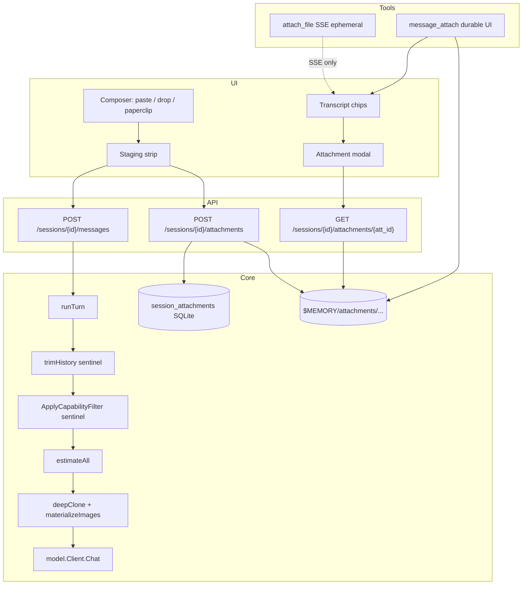

# ADR-0019: Multimodal Chat — Images & Basic Documents (No Audio)

| Field | Value |
|-------|--------|
| **Status** | Accepted (ready to implement) |
| **Date** | 2026-07-25 |
| **Author** | — |
| **Deciders** | Project owner |
| **Tags** | multimodal, attachments, images, documents, chat, cap_images, UI |
| **Extends** | ADR-0001 (inner loop / model client), ADR-0003 (SQLite + blobs), ADR-0004 (workspace upload), ADR-0005 (tools / `attach_file` Q27), ADR-0017 (actor on user messages), ADR-0018 (selectable models / `cap_images` / `ApplyCapabilityFilter`) |
| **Supersedes (partial)** | ADR-0005 Q27 for **chat-scoped** attachments only — workspace `attach_file` remains UI-only; new path is first-class. Aligns with ADR-0018 strip/re-include for unsupported modalities (Q11 locked). |
| **Answers** | `adr/0019-answers.json` (`2026-07-26T00:35:08.912Z`) |

## Overview

Marble’s chat path is **text-only end-to-end**: `model.Message.Content` is a `string` ([`internal/model/client.go`](internal/model/client.go)); user posts are JSON `{content}` ([`internal/api/server.go`](internal/api/server.go) `handleMessages`); the composer has no paste/attach staging ([`internal/web/static/app.js`](internal/web/static/app.js), [`index.html`](internal/web/static/index.html)); and agent `attach_file` emits SSE chips that are **not re-injected into model history** and **not durable in `s.ui`** (ADR-0005 Q27; [`internal/tools/memory_skills.go`](internal/tools/memory_skills.go) `attachFile`, [`session/loop.go`](internal/session/loop.go) `OnAttachment` publish-only).

Operators need true **multimodal chat**:

1. **User → agent:** paste images, paperclip/drag-drop images and basic text documents; stage before send; show in transcript; feed models that advertise `cap_images` (ADR-0018).
2. **Agent → user:** attach images/docs into the chat as durable, previewable artifacts (modal), not only ephemeral workspace path chips.
3. **Scope v1:** common image formats + basic text documents; **no audio/voice wire** (`cap_voice` stays catalog-only for later).

This ADR proposes: a **session attachment store** under `$MEMORY`, OpenAI-compatible **content parts** on the model wire, **two-phase upload + message** API, composer staging UX, capability-aware prompt build (`ApplyCapabilityFilter` real implementation), a **strict ordered** trim → filter → estimate → deep-clone materialize pipeline, token estimates for images, session-MD encoding for reload, and an evolved agent tool (`message_attach`) alongside legacy `attach_file`.

## Background & Motivation

### Current state (verified)

| Area | Today |
|------|--------|
| Model wire | `model.Message.Content string` only; `Chat` marshals JSON as string content ([`internal/model/client.go`](internal/model/client.go)) |
| User post | `POST /api/sessions/{id}/messages` body `{content}` string; empty rejected; busy → 409 ([`server.go`](internal/api/server.go) `handleMessages`) |
| Loop | `postMessage` trims empty text and returns **true without turn** ([`loop.go`](internal/session/loop.go) ~54–57); appends `model.Message{Role:"user", Content:text}` to `s.history` and UI; shallow `copy` of history then `trimHistory` → `ApplyCapabilityFilter` → `estimateAll` → `client.Chat` (~200–262) |
| Caps | `EffectiveModel.CapImages` / `CapVoice` / `CapTools` from catalog; process default `CapImages=false` ([`model_resolve.go`](internal/session/model_resolve.go)); `ApplyCapabilityFilter` is **no-op stub** |
| Provider error | Loop already special-cases image rejection text when `!em.CapImages` ([`loop.go`](internal/session/loop.go) ~266) |
| `attach_file` | Workspace path → SSE `attachment` only (not `appendUI`); tool result notes “UI only” ([`memory_skills.go`](internal/tools/memory_skills.go)); UI synthesizes ephemeral bubble ([`app.js`](internal/web/static/app.js) ~896–904) lost on `syncTranscript` |
| Workspace upload | Multipart `POST /api/workspace/upload`, max **50 MiB** ([`workspacefs.MaxUploadBytes`](internal/workspacefs/fs.go)) |
| Blobs | `$MEMORY/blobs/<id>` + `blobs` table; `SpillBlob` fails when DB not writable; `RunMaintenance` prunes closed-session blobs ([`registry.go`](internal/session/registry.go) ~508–536) — **no** attachment GC today |
| Events | `db.Event.MetaJSON` exists; `logEvent` **never sets** it (only `logModelCall` does) ([`persist.go`](internal/session/persist.go)) |
| Session MD | Text transcript; roles include `attachment` heading; `LoadFromDoc` rebuilds model history from user/assistant/tool **string** content only |
| XSS / CSP | Transcript MD via `marked` + **DOMPurify**; global `nosniff` / `X-Frame-Options: DENY`; mpub strict CSP |
| Token est | `token.Estimate` = chars/4 ([`token/estimate.go`](internal/token/estimate.go)) |
| Schema | `CurrentSchemaVersion = 3` (ADR-0018) ([`db/db.go`](internal/db/db.go)) |
| cloneMessages | Deep-copies `ToolCalls` only — **not** content parts ([`budget.go`](internal/session/budget.go)) |

### Pain points

1. Vision-capable catalog models cannot receive clipboard/screenshots from the operator UI.  
2. Agent “attachments” are transient SSE cosmetics; they do not survive reload as rich objects and cannot open in a proper viewer.  
3. Documents the agent wants to hand back have no first-class chat surface beyond workspace paths.  
4. `cap_images` is stored and shown in Settings but never enforced on content (strip is a stub).  
5. History trim/token budget would under-count multimodal prompts if images were base64-stuffed into shared history.  
6. A naive attachment GET serving stored `text/html` inline would open XSS beyond the DOMPurify transcript path.

## Goals & Non-Goals

### Goals

1. **Inbound multimodal UX:** clipboard paste, drag-drop, paperclip/file picker; staging strip before send; clear size/MIME errors.  
2. **Durable storage** of attachment bytes keyed by session + id; safe serve for preview/download; delete with session prune.  
3. **Model wire:** OpenAI-compatible multimodal `content` parts (`text`, `image_url` with `data:` base64).  
4. **Capability integration (Q11):** honor `em.CapImages` on the **outbound** path only — **strip** image parts while the active model lacks image support (with advisory); **re-include** from durable `marble-att://` history when a vision-capable model is active again. Never delete attachment bytes or sentinels from history on strip.  
5. **Outbound agent attachments:** `message_attach` stores chat-scoped artifacts, **durable `appendUI`**, modal-capable; not merely workspace chips.  
6. **Transcript + MD persistence** so restart reloads chips and model history references deterministically.  
7. **Token budget:** image token estimate + multimodal-aware `trimHistory` / `estimateAll` on **sentinel** form.  
8. **Security:** MIME allowlist, max bytes, no audio, path jail, **safe GET** (no HTML as executable), DOMPurify modal for docs, no provider SSRF.

### Non-goals (v1)

| Non-goal | Rationale |
|----------|-----------|
| Audio / voice input or output / `cap_voice` wire | Explicit product defer |
| Video | Out of scope |
| PDF OCR / full Office (docx/xlsx) parsing | Complexity; recommend text exports |
| Streaming vision / token-by-token multimodal | Chat remains non-streaming |
| Model-generated image synthesis APIs | Agent attaches existing files/bytes only |
| Public anonymous attachment URLs | Auth same as session API (ADR-0017) |
| Replacing workspace explorer upload | Unrelated surface; keep ADR-0004 |
| Client-side canvas downscale before stage | Optional future; surface provider size errors instead |
| Server-side thumbnail generation | Browser CSS/`img` scale only (Q7) |

## Key Decisions

| # | Decision | Rationale |
|---|----------|-----------|
| **KD1** | Store chat attachments under **`$MEMORY/attachments/<session_id>/<att_id>`** + SQLite table `session_attachments` (schema **v4**), not workspace and not only event blobs | Session-scoped GC; MIME/name/kind metadata; distinct from event spill (`blobs`); limp uses path convention + MD markers |
| **KD2** | **Two-phase API:** `POST …/attachments` (multipart) stages bytes → ids; `POST …/messages` JSON `{content, attachment_ids[]}` commits turn | Matches staging UX; avoids huge base64 in JSON |
| **KD3** | Model `content` is a **custom type**: **`len(Parts)>0` wins** → marshal JSON array; else marshal `Text` as string (incl. `""`). Helpers never set both | OpenAI-compatible; unambiguous marshal; text-only turns unchanged on wire |
| **KD4** | **Outbound modality filter (Q11):** Always accept user/agent image attachments into durable history (`marble-att://` + store). On each Chat build: if `!em.CapImages`, **strip** image parts on a **deep-cloned** prompt only + **one advisory per turn**; if `em.CapImages`, **re-include** (materialize). Docs always inject as text (truncated). UI may warn when staging images under a non-vision model but **must not block Send**. | History remains modality-complete; strip is temporary for the active model only |
| **KD5** | Provider wire uses **`image_url` with `data:<mime>;base64,…`** only after **deep-clone materialize** on Chat outbound; history keeps `marble-att://<id>` | No public URLs; no SSRF; history RAM stays small |
| **KD6** | Keep **`attach_file`** workspace UI-only (Q27, SSE path-only, ephemeral). Add **`message_attach`** for durable chat-scoped attachments | Clear split; no broken agent tool semantics |
| **KD7** | `message_attach` **tool** writes store + returns JSON (≤2 KiB optional preview); invokes **`TurnContext.OnChatAttachment` (new)**. **Loop** wires that callback to `appendUI` + `publish type:message` + mark dirty. **Not** legacy `OnAttachment`; tools package never holds `*session.Session`. No full image bytes in tool result / same-turn model injection | Package boundary matches `TurnContext` pattern; durable UI without tools→session coupling |
| **KD15** | User `POST …/messages` `attachment_ids`: **staged only** (`message_id IS NULL`). Already-committed ids → **400** `attachment already committed`. Re-send requires re-upload/stage (or future re-attach API). Limp: accept if file exists under validated path and id not duplicated in this request | One clear re-use rule; no multi-message share of same staged id |
| **KD8** | Image tokens: `EstimateImage(w,h)` = `85+(w*h)/750` if `w>0 && h>0`, else **`DefaultImageTokens = 1500`**. No image decode in v1 | Single constant; good enough for trim |
| **KD9** | MIME allowlist **strict**. Images: png/jpeg/webp/gif. Docs: plain/markdown/csv/json/html. **Reject** `image/svg+xml`, audio, video, pdf, office | SVG is XSS vector; gif accepted as opaque bytes |
| **KD10** | Limits: **10** attachments/message; **8 MiB/file** on disk; **20 MiB total/message**; **model inject for docs ≤ 64 KiB** (or budget-aware floor — see below); staged TTL **24h** | Disk can hold more than model may see; protect context |
| **KD11** | Session MD: attachment markers only (**never** base64); `meta_json` records inject caps/sha for deterministic reload | Human-readable MD; reload fidelity |
| **KD12** | Modal: images via GET `inline=1` (image MIME only); docs always fetched as text + DOMPurify/`textContent` — **never** iframe/srcdoc or `text/html` document navigation | XSS-safe preview |
| **KD13** | Per-iteration Chat pipeline is **ordered and pure w.r.t. history** (see § Prompt pipeline) | Prevents base64 poison and wrong estimates |
| **KD14** | **POST attachments: 400 closed, 409 busy, else 201** | Matches composer disabled-while-busy; one normative rule |

## Proposed Design

### Architecture



### Attachment identity & storage (KD1)

**Filesystem:**

```text
$MEMORY/attachments/<session_id>/<att_id>
```

- `att_id`: 16 random bytes hex = **32 lowercase hex chars** (same style as [`newBlobID`](internal/db/blobs.go)).  
- **Validation (normative):** `att_id` must match `^[0-9a-f]{32}$`; `session_id` must match existing session id charset (Crockford base32 / project convention) and must not contain `.` / `/` / `..`. Resolve path with `filepath.Join(Root, "attachments", sessionID, attID)` then **require** `strings.HasPrefix(abs, filepath.Clean(Root)+sep)`.  
- File mode `0o644`; parent dirs `0o755`.  
- **Never** under workspace.  
- **Immutability:** once written, attachment bytes are **never overwritten** (reload determinism).

**SQLite schema v4** — table `session_attachments`:

```sql
CREATE TABLE session_attachments (
  id            TEXT PRIMARY KEY,
  session_id    TEXT NOT NULL,
  created_at    TEXT NOT NULL,
  name          TEXT NOT NULL,          -- display filename
  mime          TEXT NOT NULL,          -- sniffed storage MIME (may differ from GET Content-Type for docs)
  kind          TEXT NOT NULL,          -- image | document
  byte_size     INTEGER NOT NULL,
  sha256        TEXT,                   -- hex; set on write
  source        TEXT NOT NULL,          -- staged | user_upload | agent_attach
  path          TEXT NOT NULL,          -- rel under $MEMORY e.g. attachments/<sid>/<id>
  message_id    TEXT,                   -- set when committed to a message
  meta_json     TEXT                    -- inject_bytes, truncated, width/height, etc.
);
CREATE INDEX idx_att_session ON session_attachments(session_id);
CREATE INDEX idx_att_session_msg ON session_attachments(session_id, message_id);
```

- No `FOREIGN KEY(session_id)` — consistent with `blobs`.  
- On Open: `mkdir` `$MEMORY/attachments` (like `blobs/`).  
- `migrateV3toV4`: create table + indexes; failure **aborts** process start.

**Lifecycle:**

| State | Meaning |
|-------|---------|
| `source=staged` / `message_id NULL` | Uploaded for composer; not yet in a turn |
| committed (`user_upload`) | `message_id` set when message accepted; source may flip staged→user_upload |
| agent | `source=agent_attach` after `message_attach` (message_id set to UI row id) |
| session prune / delete | **`DeleteSessionAttachments(sessionID)`** — remove rows + files |
| GC staged | unreferenced staged (`message_id IS NULL`) older than 24h |

**Session prune / delete (normative — Issue 7):**

Every path that today calls `DeleteSessionBlobs` for a session **must** also call `DeleteSessionAttachments`:

- `RunMaintenance` closed-session prune ([`registry.go`](internal/session/registry.go))  
- Any explicit session-delete / wipe helpers  

**When session row is pruned but MD file is retained** (if that mode exists): still **delete** `$MEMORY/attachments/<session_id>/` and rows. Orphan policy: prefer no attachment leaks over keeping previews for pruned sessions. If MD later reloads a pruned session and files are gone → `[missing attachment …]` placeholders (KD11).

**Limp mode (normative — Issue 8):** when SQLite not writable:

| Operation | Behavior |
|-----------|----------|
| Upload / stage | **Allowed**: write file under path convention; allocate `att_id` via same RNG as `newBlobID`; return id to client. No row insert. |
| Commit message | Encode attachment markers in session MD only (source of truth). |
| GET by id | After hex/session validation, serve file if exists — **no SQL required**. |
| List / GC staged / meta queries | **Degrade**: GC staged **skipped** in limp; list incomplete. |
| Contrast with blobs | `SpillBlob` fails closed without DB; attachments deliberately differ because chat UX needs bytes without events table |

**Not** 503-reject-all: operators in limp still paste screenshots into MD-backed sessions.

### MIME sniffing & allowlist (KD9)

On upload:

1. Read first 512 bytes; `http.DetectContentType` + extension map.  
2. Image MIME conflict with sniff → **reject**.  
3. Documents: extension + printable UTF-8 check (reuse `utf8Printable` idea from `attachFile`).  
4. Reject: `audio/*`, `video/*`, `application/pdf`, office MIME, **`image/svg+xml`**, empty, executable sniff.

**Allowlist (normative v1):**

| Kind | MIME (stored) | Extensions | Notes |
|------|---------------|------------|--------|
| image | `image/png` | `.png` | |
| image | `image/jpeg` | `.jpg`, `.jpeg` | |
| image | `image/webp` | `.webp` | |
| image | `image/gif` | `.gif` | Opaque bytes; no frame expand |
| document | `text/plain` | `.txt`, `.log` | |
| document | `text/markdown` | `.md`, `.markdown` | |
| document | `text/csv` | `.csv` | |
| document | `application/json` | `.json` | |
| document | `text/html` | `.html`, `.htm` | Stored as html; **GET never serves as text/html** (see GET policy) |

### Inbound UX

#### Composer staging

Extend [`index.html`](internal/web/static/index.html) composer:

```text
┌──────────────────────────────────────────────────────────┐
│ [📎]  [thumb.png ×] [notes.md ×]                         │  ← stage strip
│ Message Marble…                                          │
│                                              [Send]      │
└──────────────────────────────────────────────────────────┘
```

| Interaction | Behavior |
|-------------|----------|
| Paste | Clipboard `image/*` → stage upload; else default text paste |
| Drag-drop | On composer zone → stage; toast on reject |
| Paperclip | `<input type=file multiple accept="image/png,image/jpeg,image/webp,image/gif,text/plain,text/markdown,text/csv,application/json,text/html,.md,.txt,.csv,.json,.png,.jpg,.jpeg,.webp,.gif,.html,.log">` — **no** audio/pdf |
| Remove chip | `DELETE` staged attachment |
| Send | `content.trim()` **or** ≥1 attachment; POST messages with ids; clear stage on 202 |

**Busy:** disable attach + send while busy (KD14).  

**Live `activeCapImages` (Q11 / Issue 16):** on session select, session GET (`model_effective`), and `session_meta` / model SSE events, store `activeCapImages = !!model_effective.capabilities.images`. If stage has any image and `!activeCapImages` → show a **non-blocking** warning chip: *“Active model has no image support — images stay in the chat and are sent when you switch to a vision model.”* **Do not disable Send.** Server accepts the message; outbound strip happens in the turn pipeline only.

#### Message accept flow (normative — Issue 5)

Extend signature to `Registry.PostUserMessage(id, text, actor, attachmentIDs []string) error` (or options struct). HTTP `handleMessages` maps status codes.

**Order (before any busy flip leaves the session stuck):**

1. Session **closed** → **400** `"session closed"`.  
2. Decode body: `content` string + `attachment_ids []string`.  
3. `text = strings.TrimSpace(content)`; if `text == ""` **and** `len(attachment_ids)==0` → **400** `"content or attachment_ids required"`.  
4. Resolve each `attachment_id` (**KD15 — staged only**):  
   - Valid hex id; `session_id` match; file on disk.  
   - **Normal (SQLite):** `message_id IS NULL` (still staged). If row missing → **400** `attachment not found: <id>`. If `message_id` set → **400** `attachment already committed: <id>` (immutable chip/history artifact; **not** re-submittable on a later user message without re-stage).  
   - **Limp (no SQL):** accept if file exists under validated path; reject duplicate ids within the same request; no “already committed” table — MD markers are SoT after commit.  
   - Enforce KD10 totals (count, per-file, total bytes). Other fails → **400** (`too many attachments`, `message attachments exceed size limit`).  
   - Once accepted, commit sets `message_id` + source `user_upload` so the id cannot be used on a subsequent POST.  
5. **No CapImages gate on accept** (Q11). Images are always committed to durable history as `marble-att://` sentinels regardless of the active model.  
6. **Then** `tryBeginTurn`; if false → **409** `"session busy"` (session not left busy).  
7. Build UI message: title fallback if text empty → first attachment name, else `"N attachments"`.  
8. Append UI + history (sentinel form); commit attachment rows (`message_id`, source); log event with meta; publish; `go runTurn`.  
9. Outbound Chat path applies **KD4/KD13**: strip image parts on the deep-cloned prompt when `!em.CapImages` (+ advisory); re-include/materialize when `em.CapImages`.

**Error strings (UI tooltips):**

| Code | Example body |
|------|----------------|
| 400 | `content or attachment_ids required` |
| 400 | `attachment not found: <id>` |
| 400 | `attachment already committed: <id>` |
| 400 | `file type not allowed` / `file too large (max 8388608 bytes)` |
| 400 | `session closed` |
| 409 | `session busy` |

Document-only attachments always allowed regardless of `CapImages`.  
**v1 non-goal:** multi-turn re-use of the same attachment id on a new user message without re-upload (future optional re-attach/copy API).

### Wire format — model content parts (KD3, KD5)

#### Go types ([`internal/model/client.go`](internal/model/client.go))

```go
// Content is OpenAI-compatible: string OR []Part.
// Invariant: if len(Parts) > 0, Parts win on marshal; Text is ignored.
// Helpers never set both: ContentFromText clears Parts; ContentFromParts clears Text.
type Content struct {
    Text  string
    Parts []Part
}

type Part struct {
    Type     string    `json:"type"` // text | image_url
    Text     string    `json:"text,omitempty"`
    ImageURL *ImageURL `json:"image_url,omitempty"`
}

type ImageURL struct {
    URL    string `json:"url"` // data:… or marble-att://<id> (internal only)
    Detail string `json:"detail,omitempty"` // default "auto"
}
```

**Marshal / Unmarshal (normative):**

| Condition | JSON |
|-----------|------|
| `len(Parts) > 0` | array of parts (**Parts win** even if Text non-empty) |
| else | JSON string of `Text` (including `""`) |
| Unmarshal string | `{Text: s, Parts: nil}` |
| Unmarshal array | `{Text: "", Parts: …}` |

Helpers:

- `ContentFromText(s)` → `{Text: s}`  
- `ContentFromParts(parts)` → `{Parts: parts}`  
- `PlainText()` → Text or concat text parts  
- `HasImages()` → any `image_url` part  
- `Clone()` → deep copy including Parts and ImageURL pointers  

**Assistant / tool / system responses:** after `normalizeMessage`, always string form (`ContentFromText(PlainText())` or empty + tool_calls). Multimodal **user** (and reloaded user) messages may use Parts.

**High-touch compile sites:**

- [`loop.go`](internal/session/loop.go), [`budget.go`](internal/session/budget.go) — string slices on Content become part-aware (PR3)  
- [`session.go`](internal/session/session.go) `LoadFromDoc`  
- [`persist.go`](internal/session/persist.go)  
- [`client.go`](internal/model/client.go) `normalizeMessage`  
- All tests constructing `model.Message{Content: "…"}` → `ContentFromText("…")`

**UI `session.Message`:**

```go
type Message struct {
    // ...
    Content     string          `json:"content"`
    Attachments []AttachmentRef `json:"attachments,omitempty"`
}

type AttachmentRef struct {
    ID   string `json:"id"`
    Name string `json:"name"`
    Mime string `json:"mime"`
    Kind string `json:"kind"` // image | document
    Size int64  `json:"size"`
}
```

#### Building model user message from attachments

```text
parts = []
if userText != "" { parts.append text(userText) }
for each attachment_id (order preserved):
  load row + bytes; verify sha256 if set
  if kind==document:
    inject = truncateUTF8(bytes, DocInjectMaxBytes)  // default 64 KiB
    record meta: inject_bytes, truncated bool, sha256
    parts.append text("--- file: name (mime) ---\n" + inject
                      + optional "\n…[truncated for model inject; full file in chat attachment]")
  if kind==image:
    parts.append image_url url="marble-att://"+id detail="auto"
if only images and empty text:
  parts.prepend text("(user attached N image(s))")
→ history append Message{Role:user, ContentFromParts(parts)}
→ UI Content = userText or summary; Attachments = refs
```

**Disk size vs model inject (KD10 — Issue 3):**

| Limit | Value | Purpose |
|-------|-------|---------|
| Per-file disk | 8 MiB | Storage / modal / download |
| Per-message total disk | 20 MiB | Upload DoS bound |
| **Doc inject to model** | **`DocInjectMaxBytes = 64 KiB`** | Default hard cap per doc part |
| Budget-aware inject | `min(DocInjectMaxBytes, max(4 KiB, remaining_budget_chars))` optional at build time when budget known | Avoid first-turn blowup; remaining ≈ `(em.Budget() - estimate_so_far) * 3` chars |
| Tool result preview | **≤ 2 KiB** | `message_attach` only |

Full file always remains on disk for modal/download even when inject truncates.

#### History representation (normative)

- Text parts: injected (already truncated) text.  
- Image parts: **`marble-att://<att_id>` only** in `s.history`.  
- **Never** store `data:` base64 in `s.history`.  
- Sentinel must never leave the process on the wire.

### Prompt pipeline (KD13 — Issue 2)

**Normative order each `runTurn` iteration** (replaces ambiguous “materialize + filter”):

```text
1. hist := shallow snapshot of s.history slice header
2. prompt := trimHistory(hist, budget, toolEst)
     - cloneMessages MUST deep-copy Content.Parts (and ImageURL)
     - operates on sentinel form only
3. prompt := injectSoul(prompt)          // existing
4. prompt := ApplyCapabilityFilter(prompt, em)
     - strip image_url parts (incl. marble-att://) when !em.CapImages
     - sentinel form; no disk I/O
5. estIn := estimateAll(prompt) + toolEst
     - EstimateImage on image parts (1500 / formula); text via token.Estimate
     - does NOT expand base64
6. outbound := deepCloneMessages(prompt)
   materializeImages(outbound)           // marble-att:// → data: MIME;base64
     - reject any non-data / non-marble-att URL
     - only this copy is sent
7. client.Chat(ctx, outbound, toolSpecs)
```

**Unit tests (required):** after a simulated Chat, `s.history` image URLs still `marble-att://…`; estimates on a prompt with sentinels match non-base64 sizes; filter before materialize does not require reading files.

`compactSession` source: `PlainText` + `"[N images omitted from compact source]"` — never materialize images into compact Chat.

### Capability filter (KD4 / Q11 — strip while unsupported, re-include when supported)

Implement [`ApplyCapabilityFilter`](internal/session/model_resolve.go) on a **deep clone only** (never mutate `s.history`):

```text
// History always retains marble-att:// image parts after commit.
if !em.CapImages:
  for each message on the clone:
    drop image_url parts (marble-att or data)
    if message content empty → text "[image attachment omitted: model has no image support]"
  once per turn: harness advisory if any strip occurred
else:
  leave image parts intact → later materialize step expands marble-att:// to data:
// CapTools: omit tools at loop level (unchanged)
// CapVoice: no-op in v1
```

| Situation | Behavior |
|-----------|----------|
| New user send + images + `!CapImages` | **Accept** into UI/history; **strip on outbound** only + advisory (Q11) |
| Later turn with vision model (`CapImages`) | **Re-include** same history sentinels → materialize for Chat |
| Switch to non-vision model mid-session | **Strip outbound** for that turn; durable history unchanged |
| Docs without images | Always allowed (text inject) |

### Token budget & trimHistory (KD8)

```go
const DefaultImageTokens = 1500

func EstimateImage(w, h int) int {
    if w <= 0 || h <= 0 {
        return DefaultImageTokens
    }
    return 85 + (w*h)/750
}
```

`estimateAll`: text parts / Text via `token.Estimate`; image parts via `EstimateImage` (meta width/height from attachment `meta_json` if present, else unknown → 1500). **Never** estimate base64 string length.

`trimHistory` when over budget:

1. Drop oldest non-system messages.  
2. Within a multimodal message: **drop image parts first**, then truncate text parts.  
3. Preserve tool-call pairing invariants.

### Outbound — agent tools (KD6, KD7, Issue 11)

#### `attach_file` (unchanged — ephemeral)

- Workspace path → SSE `type: attachment` with `path` (no `id`).  
- **Does not** `appendUI`; **does not** survive `syncTranscript` / reload.  
- Description remains “UI-only, not re-injected.”  
- UI may show ephemeral chip; treat path-only SSE as non-durable.

#### `message_attach` (new — durable)

| Input | Notes |
|-------|--------|
| `path` | Workspace-relative (`resolve` jail) **or** |
| `attachment_id` | Copy prior session attachment to a **new** id (agent re-share); does not re-use staged user ids |
| `as` | Display name |
| `mime` | Optional; still sniffed |

**Package boundary (KD7 — normative):**

| Layer | Responsibility |
|-------|----------------|
| **Tool** (`tools` package) | Read/copy bytes; write store + row (`source=agent_attach`); build tool-result JSON; call **`tc.OnChatAttachment(att)`** if non-nil. **Never** `appendUI`, never publish SSE, never import/hold `*session.Session`. |
| **Loop** (`session` package) | Wire `TurnContext.OnChatAttachment` to: `appendUI` (`role=attachment` + `Attachments[]`) → `publish Event{Type:"message", Message:…}` → mark session dirty (persist MD). **Do not** use legacy `OnAttachment` for this path. |
| **Legacy** | `attach_file` → `OnAttachment` → SSE `type:attachment` only (ephemeral, Q27). |

```go
// tools.TurnContext — add alongside OnAttachment
OnChatAttachment func(Attachment) // durable chat-scoped; loop implements UI

// session/loop.go wiring (sketch)
tc := &tools.TurnContext{
    OnAttachment: /* attach_file SSE-only — unchanged */,
    OnChatAttachment: func(a tools.Attachment) {
        um := Message{
            Role: "attachment",
            Content: "📎 " + a.Name,
            Attachments: []AttachmentRef{{ID: a.ID, Name: a.Name, Mime: a.Mime, Kind: a.Kind, Size: a.Size}},
            CreatedAt: time.Now(),
        }
        s.appendUI(um)
        s.publish(Event{Type: "message", Message: &um})
        // dirty → MD persist on existing flush paths
    },
}
```

**Tool implementation steps:**

1. Read workspace file (≤ 8 MiB) or copy existing attachment bytes to a **new** immutable id.  
2. Write store + row (`source=agent_attach`, sha256, mime, kind); set `message_id` when loop assigns UI id **or** leave null until callback returns id — **recommended:** tool creates row with `message_id` null / agent source; loop callback sets `message_id` to the new UI message id when wiring (or tool passes att after store and loop updates row). Either way, tools package does not touch `s.ui`.  
3. `if tc != nil && tc.OnChatAttachment != nil { tc.OnChatAttachment(att) }`.  
4. Return tool result JSON (model-facing only):

```json
{
  "attached": true,
  "attachment_id": "…",
  "name": "report.md",
  "mime": "text/markdown",
  "kind": "document",
  "size": 1234,
  "preview": "…≤2KiB…",
  "note": "stored in chat; open in UI"
}
```

Preview: documents only, **≤ 2 KiB** UTF-8; images: no preview field.  
Reload source of truth: **UI messages** (from loop `appendUI`), not SSE.

**Allowed kinds:** same allowlist. Else error: use workspace / `attach_file` for non-chat files.

### Modal UX (KD12)

In [`app.js`](internal/web/static/app.js):

- Prefer `message.attachments[]` chips (durable). Path-only SSE = ephemeral.  
- Click chip with `id`:

| Kind | Modal body |
|------|------------|
| image | `` (same-origin, cookies/auth) |
| markdown | `fetch` → text → `renderMarkdown` + DOMPurify |
| plain/csv/json/html | `fetch` → **`textContent` in `<pre>`** or MD path; **never** set `iframe.src` / `srcdoc` to attachment URL |

- Footer: Download (`?inline=0` or default attachment disposition), Close.  
- Escape / backdrop closes.

### GET attachment policy (Issue 1 — security critical)

`GET /api/sessions/{id}/attachments/{att_id}`:

1. Auth as other session routes.  
2. Validate ids (hex / charset); path jail.  
3. Load row (or limp FS exists check).  
4. **Content-Type / Disposition (normative):**

| kind | `inline=1` | Content-Type | Content-Disposition |
|------|------------|--------------|---------------------|
| **image** | yes | stored image MIME (`image/png` etc.) | `inline; filename="…"` |
| **image** | no / default | same | `attachment; filename="…"` |
| **document** (any, incl. stored `text/html`) | **ignored for type** | **`text/plain; charset=utf-8`** always | **`attachment; filename="…"`** always |

5. Always set `X-Content-Type-Options: nosniff` on this route.  
6. **Never** serve `text/html`, `image/svg+xml`, or scriptable types.  
7. Optional: `Content-Security-Policy: default-src 'none'` on attachment responses for defense in depth.

Modal for images is the **only** consumer of `inline=1`. Document preview uses fetch-as-text, not navigation to GET URL as a document.

### Persistence — session MD (KD11, Issue 10)

```markdown
## 2026-07-25T12:00:00Z · user
<!-- id: m1 attachments: attA,attB -->
Please review this screenshot and notes.

## 2026-07-25T12:00:05Z · attachment
<!-- id: m2 attachment_id: attC name: "out.png" mime: image/png kind: image size: 44012 -->
📎 out.png
```

**Commit-time `meta_json` (per attachment row):**

```json
{
  "inject_bytes": 1200,
  "truncated": true,
  "sha256": "…",
  "width": 0,
  "height": 0
}
```

**LoadFromDoc / rebuild history:**

1. Parse attachment ids from markers.  
2. For each id: open file; verify sha256 if meta present — mismatch → text part `"[changed attachment <id>]"`.  
3. Missing file → `"[missing attachment <id>]"`.  
4. Document: re-apply **same** `DocInjectMaxBytes` (and stored `inject_bytes` if present as exact slice length preference: prefer re-truncate with current cap then if `meta.inject_bytes` set and file unchanged, truncate to `inject_bytes` for bit-stability).  
5. Image: `marble-att://id` sentinel.  

Attachment files are immutable → re-read + meta yields deterministic inject when caps unchanged; if cap constant changes across versions, `inject_bytes` in meta pins prior inject length when sha matches.

### Session events / logEvent (Issue 6)

Today `logEvent` never sets `MetaJSON`. **Normative change:**

```go
// Extend logEvent (or add logUserMessage):
func (r *Registry) logEvent(..., meta map[string]interface{}) {
    // marshal meta → Event.MetaJSON when non-nil
}
```

For `kind=user_message` with attachments:

```json
{
  "attachment_ids": ["…"],
  "image_count": 1,
  "doc_count": 1
}
```

Content field remains **text only** (no base64). Tests in PR4 assert `meta_json` populated.

### API / Interface Changes

| Method | Path | Behavior |
|--------|------|----------|
| `POST` | `/api/sessions/{id}/attachments` | multipart `file`; optional `name`. MaxBytesReader = 8 MiB+slop. **400 closed, 409 busy, else 201** `{id,name,mime,kind,size}`. MIME/size errors → 400. |
| `DELETE` | `/api/sessions/{id}/attachments/{att_id}` | Only staged (`message_id` null); 404/400 otherwise; 409 if busy optional (recommend allow delete of staged when busy so user can cancel — **or** 409 busy for simplicity: **409 busy**) |
| `GET` | `/api/sessions/{id}/attachments/{att_id}` | See **GET attachment policy** above |
| `POST` | `/api/sessions/{id}/messages` | `{ "content": string, "attachment_ids": ["…"] }` — see **Message accept flow**; **KD15 staged-only** ids |
| SSE | `message` | Primary for durable attachment UI rows |
| SSE | `attachment` | Legacy `attach_file` path-only; optional live hint for `message_attach` but not reload source |
| GET session | | `messages[].attachments[]`; `model_effective` for cap gate |

**Auth:** ADR-0017 middleware (same as other session routes).

### Data Model Changes

1. Schema **v4**: `session_attachments` + indexes; `CurrentSchemaVersion = 4`; mkdir `attachments/`.  
2. `model.Content` type + helpers.  
3. `session.Message.Attachments`; tools `Attachment` gains `ID, Kind, Mime, Source`.  
4. `memory.TranscriptMessage` attachment fields.  
5. `logEvent` meta parameter.  
6. `DeleteSessionAttachments` + prune wiring.  
7. Constants: `DocInjectMaxBytes=64<<10`, `DefaultImageTokens=1500`, chat max file 8 MiB.

### Sequence — user image paste

```mermaid
sequenceDiagram
  participant U as Operator UI
  participant API as marble-harness
  participant FS as attachments FS
  participant L as runTurn
  participant M as Model API

  U->>API: POST /attachments (png)
  Note over API: 409 if busy; 400 if closed
  API->>FS: write file
  API-->>U: 201 {id}
  U->>API: POST /messages {content, attachment_ids}
  API->>API: resolve atts; resolveEffective CapImages
  alt !CapImages
    API-->>U: 400
  else busy
    API-->>U: 409
  else ok
    API->>L: history with marble-att:// (tryBeginTurn)
    loop each model call
      L->>L: trimHistory (sentinel)
      L->>L: ApplyCapabilityFilter (sentinel)
      L->>L: estimateAll
      L->>L: deepClone + materializeImages → data:
      L->>M: Chat(outbound)
      M-->>L: assistant text
    end
    L-->>U: SSE message
  end
```

## Alternatives Considered

### A1. Workspace-only storage

**Rejected** — pollutes workspace; weak GC; path ≠ chat artifact.

### A2. Single multipart POST for message + files

**Rejected** as sole API; two-phase is primary.

### A3. Always base64 in session MD / history

**Rejected** (KD11 / sentinel).

### A4. Provider-hosted image URLs

**Rejected** — SSRF / not local-first.

### A5. Expand `attach_file` only

**Rejected** — breaks Q27; use `message_attach`.

### A6. Fail-closed HTTP 400 when `!cap_images` on new image sends

**Rejected** by locked **Q11**. Operators may send images under a text-only model; strip is **outbound-only** and reversible when a vision model is selected. Durable store + `marble-att://` history remain intact (KD4).

### A7. Reject all attachment uploads in limp (503)

**Rejected** in favor of FS-only write/GET + MD markers (Issue 8) so chat still works when SQLite is limp.

## Security & Privacy

| Threat | Severity | Mitigation |
|--------|----------|------------|
| Path traversal | High | Hex att_id; charset session_id; Join + prefix check |
| **XSS via GET `text/html` inline** | **Critical** | Documents always `text/plain` + `Content-Disposition: attachment`; images only for inline image MIME; **reject SVG**; modal never iframe |
| MIME polyglot | Medium | Sniff + allowlist; nosniff |
| XSS via .md preview | High | DOMPurify / textContent only |
| Audio/video surprise | Low | Reject MIME |
| Secret exfil via vision | Medium | Operator trust; document risk |
| Provider SSRF | High | materialize → **only** `data:`; reject other schemes |
| Oversized body DoS | Medium | 8 MiB/file; 10 files; 20 MiB total |
| Cross-session read | High | session_id match + auth |
| Agent path escape | High | workspace `resolve` jail only |
| HTML stored but safe | High | Storage MIME may be text/html; GET forces text/plain |

## Observability

| Surface | Content |
|---------|---------|
| Upload / message | Log sizes + mime + counts (not raw bytes) |
| `session_events.meta_json` | `attachment_ids`, `image_count`, `doc_count` via **extended `logEvent`** |
| Harness advisories | Strip on `!cap_images`; doc truncate; missing/changed attachment; **provider image/size errors** with “try smaller PNG/JPEG” |
| UI toast | Surface 400 bodies; provider failure after Chat |

## Risks & Mitigations

| Risk | Severity | Mitigation |
|------|----------|------------|
| Context blowup (images + docs) | High | 64 KiB doc inject; image estimates; trim drops images first; budget-aware inject optional |
| Provider rejects gif / huge data URL | Medium | Surface error body as harness advisory + UI toast; suggest smaller PNG/JPEG; no resize pipeline in v1 |
| Wrong catalog `cap_images` | Medium | Outbound strip + advisory; Settings; re-include when corrected |
| Materialize mutates history | High | KD13 pipeline + tests |
| MD reload ≠ original inject | Medium | immutable files + meta inject_bytes/sha256 |
| Schema v4 migrate fail | High | Abort Open; backup |
| Attachment dir leak | High | DeleteSessionAttachments on every blob prune path |
| `message_attach` implemented as SSE-only or tools-side UI | High | KD7: `OnChatAttachment` → loop `appendUI` + `type:message` only |
| Double storage workspace + attach | Low | Accept; document copy-in |

## Rollout Plan

1. Schema v4 + FS helpers + delete/GC + tests.  
2. `model.Content` + golden JSON text-only wire.  
3. Budget/trim/filter on synthetic parts.  
4. Upload/GET (safe policy) + message flow + logEvent meta + loop pipeline.  
5. Session MD + LoadFromDoc fidelity.  
6. UI staging/chips/modal (`activeCapImages`).  
7. `message_attach` durable path.  
8. README / answers.

**Rollback:** older binary + v4 DB → limp. Orphan attachment files if mixed versions — maintenance GC.

**Feature flag:** not required.

**Manual verification:**

1. `cap_images=1` → paste PNG → model describes.  
2. `cap_images=0` → paste + send **succeeds**; advisory strip on outbound; UI chip still shows image.  
3. Switch same session to vision model → **re-include** prior image sentinels on next turn.  
4. Switch back to non-vision → strip outbound again; history still sentinel.  
5. `message_attach` md → durable chip after restart + modal.  
6. Upload `.html` → GET is `text/plain` attachment; modal uses textContent.  
7. Reject `.mp3`, `.pdf`, `.svg`.  
8. Closed session prune removes attachments dir.

## Decisions locked (Q1–Q12)

| ID | Decision |
|----|----------|
| **Q1** | Stage while busy → **409** (match message path) |
| **Q2** | **8 MiB**/file · **20 MiB** total · **10** files; doc model inject **64 KiB** |
| **Q3** | Accept **GIF** as opaque image bytes |
| **Q4** | HTML: allow store; GET **text/plain** + attachment; preview DOMPurify/text only |
| **Q5** | `message_attach` tool preview ≤ **2 KiB** |
| **Q6** | Process `CapImages` remains **false** |
| **Q7** | **No** server thumbnails in v1 |
| **Q8** | Compact source: **placeholders only** (no image bytes) |
| **Q9** | image `detail`: **`auto` only** |
| **Q10** | Schema **v4** = `session_attachments` only |
| **Q11** | **Strip while modality unsupported; re-include when a supporting model is active** (outbound-only; durable history keeps `marble-att://`) — **not** fail-closed 400 on send |
| **Q12** | **Defer PDF**; reject with convert-to-md/png guidance |

## PR Plan

Ordered, independently reviewable. **Text-only sessions with no `attachment_ids` must behave identically to pre-ADR** on every PR.

### PR1 — Schema v4 + attachment store + prune

- **Title:** `db: schema v4 session_attachments + FS store + GC`
- **Files:** [`internal/db/db.go`](internal/db/db.go) (`CurrentSchemaVersion=4`, `migrateV3toV4`, mkdir `attachments/`), new `internal/db/attachments.go` (CRUD, `DeleteSessionAttachments`, GC staged 24h), [`internal/session/registry.go`](internal/session/registry.go) `RunMaintenance` + any delete path that calls `DeleteSessionBlobs`, `db_test.go`
- **Dependencies:** none
- **Description:** Table + indexes `(session_id)`, `(session_id, message_id)`; id validation helpers; limp-safe path resolve; wire delete on prune. No HTTP.

### PR2 — model.Content multimodal type

- **Title:** `model: Content string|parts OpenAI wire`
- **Files:** [`internal/model/client.go`](internal/model/client.go), new `internal/model/content.go`, `content_test.go`; fix all compile breakages with `ContentFromText`
- **Dependencies:** none (parallel PR1)
- **Acceptance:** all packages compile; existing session tests green; **golden JSON** Chat body for text-only messages identical to pre-change (`"content":"hello"` not array). `normalizeMessage` keeps assistant/tool as string form. Minimal budget compile fix: `PlainText()` for any remaining string ops (behavior fix in PR3).
- **Note:** May merge with PR3 if review load allows (Issue 14).

### PR3 — Budget / trim / capability filter

- **Title:** `session: multimodal estimate, trim, ApplyCapabilityFilter`
- **Files:** [`budget.go`](internal/session/budget.go) (`cloneMessages` deep-copy Parts; part-aware trim), [`model_resolve.go`](internal/session/model_resolve.go), [`token/estimate.go`](internal/token/estimate.go) `EstimateImage` + `DefaultImageTokens=1500`, unit tests with **synthetic parts only** (no FS)
- **Dependencies:** PR2
- **Acceptance:** estimate/trim/filter unit tests; strip when `!CapImages`; text-only path token-identical within rounding.

### PR4 — Upload / safe GET / message wiring / pipeline / logEvent

- **Title:** `api/session: chat attachments + strip/re-include pipeline`
- **Files:** new `internal/api/attachments.go`, [`server.go`](internal/api/server.go), [`loop.go`](internal/session/loop.go) (accept flow + **KD13 pipeline**), [`session.go`](internal/session/session.go), [`persist.go`](internal/session/persist.go) **extend `logEvent` meta**, MIME helper, tests (GET never text/html; history stays sentinel after Chat; accept images under `!CapImages`; strip outbound only; empty text+atts OK)
- **Dependencies:** PR1, PR2, PR3
- **Description checklist:** two-phase API; GET policy; message accept order; DocInjectMaxBytes=64KiB; meta_json on user_message; materialize only on deep clone.

### PR5 — Session MD persistence + reload fidelity

- **Title:** `memory: encode/decode message attachments`
- **Files:** [`session_md.go`](internal/memory/session_md.go), tests, [`session.go`](internal/session/session.go) `LoadFromDoc` (sha + inject_bytes)
- **Dependencies:** PR4
- **Description:** Markers without base64; missing/changed placeholders; bit-stable inject when meta present.

### PR6 — UI staging, chips, modal

- **Title:** `web: composer attach + attachment modal`
- **Files:** [`index.html`](internal/web/static/index.html), [`app.js`](internal/web/static/app.js), [`style.css`](internal/web/static/style.css)
- **Dependencies:** PR4; **PR5 preferred for reload chips** — if PR6 ships first, document “reload chips require PR5”
- **Description:** paste/drop/paperclip; `accept=` allowlist; `activeCapImages` warning (non-blocking) when staging images under non-vision model; chips from `message.attachments[]`; modal (img vs text/DOMPurify); no iframe.

### PR7 — `message_attach` durable tool

- **Title:** `tools: message_attach chat-scoped attachments`
- **Files:** [`specs.go`](internal/tools/specs.go), [`registry.go`](internal/tools/registry.go) (`OnChatAttachment` on `TurnContext`), tool impl (store + JSON + callback only), [`loop.go`](internal/session/loop.go) **wires** `OnChatAttachment` → `appendUI` + `type:message` + dirty, system prompt line in [`session.go`](internal/session/session.go)
- **Dependencies:** PR4 (PR5 for MD of agent chips)
- **Description:** **Boundary:** tool never `appendUI`/SSE; loop owns durable UI. Do **not** call legacy `OnAttachment` for `message_attach`. Leave `attach_file` → `OnAttachment` Q27 intact; ≤2 KiB preview.

### PR8 — Docs / README

- **Title:** `docs: multimodal attachments operator notes`
- **Files:** [`README.md`](README.md), ADR → Accepted when answers locked, `adr/0019-answers.json`
- **Dependencies:** PR6–PR7
- **Description:** Allowlist, disk vs inject limits, cap_images Settings, XSS GET policy note.

## References

- [`adr/0018-selectable-models.md`](adr/0018-selectable-models.md) — `cap_images`, `ApplyCapabilityFilter`, EffectiveModel; Q11 aligns strip/re-include with outbound filter
- [`adr/0005-tools-and-agent-loop.md`](adr/0005-tools-and-agent-loop.md) — `attach_file` Q27  
- [`adr/0004-workspace-file-explorer.md`](adr/0004-workspace-file-explorer.md) — multipart upload  
- [`adr/0003-sqlite-memory-db.md`](adr/0003-sqlite-memory-db.md) — blobs / events / prune  
- OpenAI Chat Completions multimodal content parts  
- Code: [`internal/model/client.go`](internal/model/client.go), [`internal/session/loop.go`](internal/session/loop.go), [`internal/session/budget.go`](internal/session/budget.go), [`internal/session/model_resolve.go`](internal/session/model_resolve.go), [`internal/session/persist.go`](internal/session/persist.go), [`internal/session/registry.go`](internal/session/registry.go), [`internal/tools/memory_skills.go`](internal/tools/memory_skills.go), [`internal/db/blobs.go`](internal/db/blobs.go), [`internal/web/static/app.js`](internal/web/static/app.js)

## Changelog

| Date | Change |
|------|--------|
| 2026-07-25 | Initial draft (Proposed) — multimodal images + basic documents; no audio |
| 2026-07-25 | Review revision: safe GET (no HTML XSS); KD13 materialize pipeline; 64 KiB doc inject; message accept/busy order; logEvent meta; prune deletes; limp FS rules; Content Parts-wins; reload meta/sha; durable message_attach UI; KD14 busy staging; DefaultImageTokens=1500; PR acceptance criteria |
| 2026-07-25 | Revision 2: KD7/PR7 `OnChatAttachment` boundary (tool store+JSON; loop appendUI+message); KD15 staged-only `attachment_ids` on user POST |
| 2026-07-26 | **Accepted** — Q1–Q12 locked from `0019-answers.json`. **Q11 custom:** strip only while modality unsupported; re-include when vision model returns (not fail-closed 400). KD4/goals/accept flow/UI/PR4 updated. |
