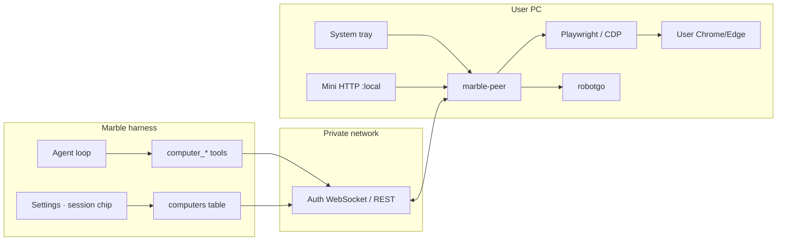

# ADR-0020: Marble Peer — Remote Computer Use (Browser CDP + Desktop)

| Field | Value |
|-------|--------|
| **Status** | Accepted (ready to implement) |
| **Date** | 2026-07-26 |
| **Author** | — |
| **Deciders** | Project owner |
| **Tags** | computer-use, peer, playwright, CDP, robotgo, tray, registration, tools, MCP, multi-repo |
| **Extends** | ADR-0001 (agent loop), ADR-0003 (SQLite), ADR-0005 (tools), ADR-0006 (MCP), ADR-0007 (Settings), ADR-0017 (auth), ADR-0018 (model caps / vision), ADR-0019 (attachments / screenshots in chat) |
| **Related research** | [`adr/computer-use-remote-desktop.html`](computer-use-remote-desktop.html) |
| **Peer implementation** | [**ADR-0021**](0021-marble-desktop-peer.md) — process, browser, desktop, tray, packaging |
| **Answers** | `adr/0020-answers.json` (`2026-07-27T02:40:13.716Z`) |
| **Peer repo** | **`marble-desktop-peer`** (binary **`marble-peer`**) — separate repository; not inlined in harness monorepo |

## Overview

Marble needs **remote “hands and eyes”** on an operator’s **personal computer** so the agent can complete real-world web tasks (travel, food, tax portals, etc.) while **inheriting the user’s existing browser sessions** — without Marble implementing on-behalf-of OAuth, card vaults, or per-site scrapers.

This ADR defines:

1. **`marble-desktop-peer`** — a **separate repository** shipping the multi-platform desktop agent (Windows / macOS / Linux). Binary name: **`marble-peer`** (**Q9**).  
2. **Browser control** via **Playwright MCP/helper + CDP** first (**Q1**); dedicated **Marble debug browser profile** the user logs into once (**Q2**).  
3. **Desktop control** via **[robotgo](https://github.com/go-vgo/robotgo)** (screenshot + mouse/keyboard) as a secondary computer-use path; **primary display only** (**Q5**).  
4. **Mutual handshake registration** (CLI and/or local mini browser on the peer).  
5. **Minimal UI:** no full native GUI app; **system tray** ([`getlantern/systray`](https://github.com/getlantern/systray) or maintained fork — **Q8**) for status + stop / restart / re-pair; **start at user login**.  
6. **Harness (this monorepo)** owns tools + Settings UX + pairing API + SQLite registry so sessions can bind a peer and the model can call a stable tool surface.  
7. **Wire contract** documented as **OpenAPI/JSON in marble docs** (**Q10**); extract a shared Go module only if duplication hurts later.

**Architecture principle:** robotgo/Playwright run **only in the desktop-peer process**. Marble harness is the **brain** (tool loop + model). The wire is authenticated JSON (HTTP/WebSocket) over a private network path (Tailscale preferred; reverse dial-out allowed). **Peer code does not live under `github.com/rendicott/marble`**.

## Background & Motivation

### Current state

| Area | Today |
|------|--------|
| Tools | Filesystem, shell, MCP, `web_fetch`, `call_agent_process`, etc. — **no** remote GUI/browser control of a personal PC |
| MCP | Process-local stdio/HTTP servers from `$MEMORY/mcp.json` (ADR-0006) — cannot reach a home PC behind NAT unless operator configures tunnels by hand |
| Multimodal | ADR-0019 can put **images into chat** for vision models; nothing **captures** a remote desktop or drives clicks |
| Auth inherit | `web_fetch` and cloud browsers do **not** see the user’s Amazon/airline cookies |

### Pain points

1. Operators want the agent to act **as them** on sites where they are already logged in.  
2. Cloud computer-use products run **isolated** browsers — wrong default for personal commerce/admin.  
3. Writing three OS-specific agents is unnecessary if browser uses CDP/Playwright and desktop uses one library (robotgo).  
4. Pairing must be **mutual and explicit** (high privilege surface), not a hard-coded auth key in a unit file.

## Goals & Non-Goals

### Goals

1. **Separate repo `marble-desktop-peer`** owning all desktop agent code, CI, and multi-arch peer releases (Windows, macOS, Linux).  
2. **Browser path (primary):** Playwright-driven CDP attach / launch-with-debug so agent sees **real logged-in sessions** when the operator chooses that mode.  
3. **Desktop path (secondary):** robotgo screenshot + click/type/key for OS dialogs and non-DOM UI.  
4. **Mutual registration handshake** from:
   - **CLI** on either side, and/or  
   - **Mini browser** served by the peer (localhost HTML — not a native GUI toolkit app).  
5. **System tray** only for ongoing UX: peered/offline status, **Stop**, **Restart**, **Re-pair**, open mini browser / logs.  
6. **Autostart at user login** (OS login item / user systemd / Run key — per platform, documented).  
7. **Harness integration (marble monorepo only):** SQLite registry of computers, Settings UI, session bind, agent tools, safety gates (confirm money/high-risk), screenshot → ADR-0019 attachment when vision needed.  
8. **Capability advertisement:** peer reports `browser` / `desktop` / `confirm` so tools can fail closed when offline.  
9. **Versioned wire protocol** (`peer_protocol_version`) negotiated at connect so harness and peer can release on independent schedules.

### Non-goals (v1)

| Non-goal | Rationale |
|----------|-----------|
| Full native GUI app (Electron/Wails window chrome beyond tray + optional local HTTP pages) | Owner: avoid native GUI; mini browser + tray + CLI suffice |
| Inlining peer sources inside the Marble harness monorepo | Owner: dedicated **`marble-desktop-peer`** repo for release isolation, native deps (robotgo/CGO, Playwright), and desktop CI |
| Cloud Browserbase/Operator as primary path | Wrong auth-inheritance model (research note) |
| Export cookies/passwords into Marble or the model | Catastrophic credential exfil risk |
| Unattended high-value payments without human confirm | Safety |
| Mobile (iOS/Android) peers | Desktop only |
| Controlling a machine without an interactive user session | Login-time start implies user session / seat |
| Cron / unattended peer drives | **Q4:** interactive sessions only in v1 |
| Multi-monitor desktop control | **Q5:** primary display only |
| Replacing `call_agent_process` / coding harnesses | Different tool (ADR-0014) |
| Perfect Wayland coverage on day one | Document X11 preference; degrade gracefully |
| Shared Go `peerprotocol` module in v1 | **Q10:** OpenAPI/JSON docs first |

## Key Decisions

| # | Decision | Rationale |
|---|----------|-----------|
| **KD1** | Ship the desktop agent from a **separate repository `marble-desktop-peer`**, binary **`marble-peer`** (**Q9**) — not inside harness process or monorepo tree | Peer on user desktop; harness may be remote. Isolates CGO/robotgo/Playwright CI, release, signing. |
| **KD2** | **Browser v1 = Playwright MCP/helper + CDP** (**Q1**). Default auth inherit via **dedicated Marble debug profile** user logs into once (**Q2**). Isolated Playwright context is opt-in/demo only. chromedp later if Node weight hurts. | Fast path to CDP ecosystem; dedicated profile avoids Chrome default-profile CDP locks. |
| **KD3** | **Desktop = robotgo** behind a thin package; one codebase, three GOOS builds; **primary monitor only** (**Q5**) | Avoid three OS agents; multi-monitor deferred. |
| **KD4** | **Mutual handshake registration** with short-lived codes on **both** sides (see § Registration) | Neither side trusts a static shared secret alone. |
| **KD5** | Pairing UX: **CLI** and/or **peer-local mini HTTP UI** (`127.0.0.1` by default). **No** full native settings window | Operator requirement. |
| **KD6** | **System tray** via **`getlantern/systray` or maintained fork** (**Q8**): status, Stop, Restart, Re-pair, Open mini UI, Quit | Only allowed native surface. |
| **KD7** | Peer **starts at user login** (user-level autostart, not root boot) | Needs graphical seat for browser + input. |
| **KD8** | Wire: **authenticated WebSocket** + REST for pairing/health; peer **dial-out** default. Pairing may use **HTTP on private mesh with operator confirm**; **prefer HTTPS** (**Q6**) | NAT-friendly; honest about Tailscale HTTP. |
| **KD9** | Agent-facing **Marble-native `computer_*` tools** proxy to peer; peer may run Playwright MCP **internally** | Stable tool names; impl can swap. |
| **KD10** | Screenshots → ADR-0019 attachments / vision when `cap_images` | Existing multimodal path. |
| **KD11** | **No cookie export APIs** | Security non-negotiable. |
| **KD12** | High-risk → **`computer_confirm`**; timeout **120s, deny on timeout** (**Q3**) | Money/auth human gate. |
| **KD13** | Schema **v5**: `computers` + session `computer_id` | Durable registry. |
| **KD14** | Max **8** computers; **1** bound per session; **1 action queue** (serialize) per computer (**Q7**) | Simple ops + safety. |
| **KD15** | Google auth: only **allowlisted admins** register/bind peers | Full admin surface. |
| **KD16** | **Repo split** + protocol as **OpenAPI/JSON in marble docs** (**Q10**); optional Go module later. Harness never imports robotgo. | Independent releases; clear ownership. |
| **KD17** | **No cron → peer** in v1 (**Q4**) | Unattended computer-use risk. |

## Proposed Design

### Architecture



### Components

| Component | Repo | Responsibility |
|-----------|------|----------------|
| **`cmd/marble-peer`** (or `marble-desktop-peer`) | **marble-desktop-peer** | Daemon: tray, autostart, pairing client, WS, action executor |
| **`internal/browser`, `internal/desktop`, `internal/tray`, `internal/miniui`** | **marble-desktop-peer** | Playwright/CDP, robotgo, tray, embedded pair/status HTML |
| **Protocol types / version** | Shared contract (doc + optional small module) | Message shapes, auth headers, `peer_protocol_version` |
| **`internal/api/computers.go`** | **marble** | CRUD, pairing codes, proxy tool RPCs, health, WS hub |
| **`computer_*` tools** | **marble** | Agent-facing tools that RPC to bound peer |
| **Settings → Computers** | **marble** | List peers, pair, revoke, policy |
| **Session chrome** | **marble** | Peer picker / status pill |

### Browser subsystem (Playwright / CDP)

**Locked implementation (**Q1**):**

| Option | Role |
|--------|------|
| **A — v1** | Peer runs **Playwright MCP or a pinned Playwright Node helper** against CDP (`--cdp-endpoint` / profile launch); peer translates Marble tool RPCs ↔ MCP/JSON |
| **B — later** | **chromedp** (Go) if Node install weight or packaging becomes painful |

**Normative operator modes (**Q2**):**

1. **Dedicated Marble debug profile (default for auth inherit):** peer launches/manages a Chromium user-data dir (e.g. `~/.marble-peer/chrome-profile`) with remote debugging; operator logs into sites **once** in that profile.  
2. **Isolated (optional):** clean context — demos only; UI must label “no personal logins.”

**Browser tools (agent-facing names):**

| Tool | Purpose |
|------|---------|
| `computer_browser_tabs` | List open tabs (title, url, id) |
| `computer_browser_open` | Navigate / new tab |
| `computer_browser_snapshot` | Accessibility / simplified DOM text (cheap for LLM) |
| `computer_browser_act` | `click` / `type` / `press` / `select` / `scroll` by role, text, or ref from snapshot |
| `computer_browser_eval` | **Forbidden in v1** (or heavily sandboxed) — XSS / exfil risk |

Prefer **snapshot + act** over pure vision for web tasks; fall back to desktop/screenshot when DOM is useless (canvas, weird widgets).

### Desktop subsystem (robotgo)

Long-running peer maps JSON ops → local calls:

| Op | robotgo (conceptual) |
|----|----------------------|
| `screenshot` | `CaptureScreen` → JPEG/PNG (scaled max edge e.g. 1280) |
| `click` | `MoveClick(x, y)` |
| `type` | `TypeStr` / clipboard paste for unicode |
| `key` | `KeyTap` / modifiers |
| `move` | `Move` / relative optional |

**Coordinate space:** report `screen_w`, `screen_h`, `scale` with every screenshot; model actions use that space. Multi-monitor v1: **primary display only** (**Q5**).

**Desktop tools:**

| Tool | Purpose |
|------|---------|
| `computer_screenshot` | Capture → attachment id + meta |
| `computer_desktop_act` | click / type / key / move (gated by policy) |

### Registration — mutual handshake

**Threat:** peer is remote code execution on the user’s desktop. Registration must be **interactive and mutual**.

#### Artifacts

| Artifact | Lifetime | Storage |
|----------|----------|---------|
| **Pairing session id** | ≤ 10 minutes | Harness memory + peer memory |
| **Harness code** `H-XXXXXX` | ≤ 10 minutes, single use | Shown in Marble Settings |
| **Peer code** `P-XXXXXX` | ≤ 10 minutes, single use | Shown in peer CLI or mini browser |
| **Device credential** | Long-lived | Peer: OS keychain / DPAPI / libsecret / file mode 0600; Harness: SQLite hash of device public key or opaque token hash |
| **Device id** | Permanent until revoke | UUID slug |

#### Flow (normative)

```text
1. Operator opens Marble Settings → Computers → "Pair new computer"
   → harness creates pairing_session, displays H-code + optional QR of
     { harness_url, pairing_session_id }

2. On desktop, operator runs ONE of:
   a) marble-peer pair --harness https://… --code H-XXXXXX
   b) marble-peer pair --serve   # opens http://127.0.0.1:7xxx/pair
      (paste harness URL + H-code in mini form)

3. Peer connects to harness pairing endpoint (prefer HTTPS; **HTTP allowed
   on private mesh only after operator confirm** — Q6).
   Peer authenticates with H-code + pairing_session_id.
   Peer displays P-code (CLI print + mini UI).

4. Operator enters P-code in Marble Settings (same pairing session).
   Harness verifies peer’s attested device pubkey + P-code.

5. Both sides seal:
   - harness stores computer row (enabled, caps, endpoint hint)
   - peer stores device credential + harness base URL
   - pairing codes invalidated

6. Steady state: peer dials WebSocket / harness connects if reachable;
   mutual TLS-or-token heartbeat every 30s.
```

**Mutual** means: harness alone knowing a code is insufficient; peer alone knowing a code is insufficient; operator must complete **both** code entries (or equivalent confirm buttons on both UIs).

**Re-pair:** tray → Re-pair clears local device credential and starts flow again; old harness row marked `revoked` or replaced.

**Revoke:** Settings → Revoke computer invalidates device credential server-side; peer goes offline on next heartbeat.

### Peer runtime UX (no full native GUI)

| Surface | Role |
|---------|------|
| **System tray** | Icon color: green peered / yellow degraded / red offline / gray stopped. Menu: Status, Open mini UI, Stop actions, Restart, Re-pair, Quit |
| **Mini HTTP UI** | `127.0.0.1` only (default): pair form, status, recent actions log, confirm prompts, policy read-only |
| **CLI** | `marble-peer run`, `pair`, `status`, `unpair`, `install-autostart`, `version` |
| **Confirm prompt** | Mini UI + tray notification; timeout **120s → deny** (**Q3**) |

Native GUI frameworks (Qt, Electron full window, Wails main window) are **out of scope**. Tray + localhost HTML is the product UX.

### Autostart (user login)

| OS | Mechanism (v1) |
|----|----------------|
| **Windows** | `marble-peer install-autostart` → HKCU Run **or** Startup folder shortcut (user scope) |
| **macOS** | LaunchAgent `~/Library/LaunchAgents/com.rendicott.marble-peer.plist` |
| **Linux** | `~/.config/systemd/user/marble-peer.service` **or** XDG autostart `.desktop` |

Must **not** require root. Document that peer needs an **unlocked graphical session** for desktop/browser control.

### Network topology

| Mode | When |
|------|------|
| **A. Peer dial-out (default)** | Peer maintains outbound WS to harness `/api/computers/ws` — works through home NAT |
| **B. Harness dial-in** | If peer publishes Tailscale IP + port and harness can reach it — lower latency optional |

Prefer **A** for least router config. Auth token on every frame.

### Harness data model (schema v5)

```sql
-- migrateV4toV5
CREATE TABLE computers (
  id            TEXT PRIMARY KEY,          -- slug e.g. home-laptop
  display_name  TEXT NOT NULL,
  device_id     TEXT NOT NULL UNIQUE,      -- peer-generated UUID
  token_hash    TEXT NOT NULL,             -- harness verifies peer
  os            TEXT NOT NULL,             -- windows|darwin|linux
  caps_json     TEXT NOT NULL,             -- {"browser":true,"desktop":true,"confirm":true}
  endpoint_hint TEXT,                      -- last known ts IP / empty if dial-out only
  policy_json   TEXT,                      -- domain allow/deny, require_confirm_money
  enabled       INTEGER NOT NULL DEFAULT 1,
  revoked_at    INTEGER,
  last_seen_at  INTEGER,
  created_at    INTEGER NOT NULL,
  updated_at    INTEGER NOT NULL
);

-- session bind
ALTER TABLE sessions ADD COLUMN computer_id TEXT;  -- empty = unbound
```

Ephemeral pairing sessions may be **memory-only** or a small `computer_pairings` table with TTL GC.

### Agent tools (normative catalog)

| Tool | Args (sketch) | Notes |
|------|----------------|-------|
| `computer_list` | — | id, name, os, online, caps, last_seen |
| `computer_bind` | `computer_id` \| `""` | Session bind; empty clears |
| `computer_screenshot` | `computer_id?` | Uses bound peer; returns attachment ref |
| `computer_browser_tabs` | | |
| `computer_browser_open` | `url`, `new_tab?` | |
| `computer_browser_snapshot` | | text snapshot |
| `computer_browser_act` | `action`, `target`, `text?` | |
| `computer_desktop_act` | `action`, `x?`, `y?`, `text?` | Requires `caps.desktop` |
| `computer_confirm` | `prompt`, `risk` | Blocks until user accepts/denies on peer |
| `computer_stop` | | Cancel in-flight peer actions for session |

**Default computer:** session `computer_id` if set; else if exactly one online peer, tools may use it with advisory; if multiple online and unbound → tool error “bind a computer first.”

### Safety & policy

| Control | Behavior |
|---------|----------|
| **Domain policy** | Optional allowlist/denylist on peer + harness; browser_open checks host |
| **Money / auth risk** | Heuristic URL/path patterns + explicit `risk=money|auth` on confirm; checkout flows should call `computer_confirm` |
| **Action queue** | **Serialize: depth 1** per computer (**Q7**) — no parallel peer acts |
| **Cron** | **Must not** invoke peer tools / bound computer (**Q4**) |
| **Rate limit** | Additional soft cap optional; queue already serializes |
| **Stop** | Marble turn Stop + `computer_stop` + tray Stop all cancel peer ops |
| **Audit** | `session_events` meta: computer_id, op, url host (not full secrets) |
| **No cookie dump** | Hard reject any internal API that serializes cookie jars to the model |

### Settings & chat UX

**Settings → Computers**

- List: name, OS, online, last seen, caps, Revoke, Edit policy  
- **Pair computer** → show H-code + harness URL + wait for P-code field  
- Copy-friendly for mobile operators

**Session header**

- Pill: `PC: home-laptop ●` / `PC: none` / `PC: offline`  
- Dropdown to bind (same pattern as model picker ADR-0018)

**Confirm**

- When tool waits on confirm, turn progress shows “Waiting for confirm on home-laptop…”  
- Peer mini UI + tray notification

### Repository layout

#### `marble` (this monorepo) — brain only

```
internal/api/computers.go      # pairing + WS hub + proxy
internal/db/computers.go       # schema v5
internal/tools/computer.go     # computer_* tools
internal/web/static/           # Settings Computers + session pill
docs/peer-protocol.md          # or openapi/peer-v1.yaml — contract source of truth (Q10)
```

Does **not** contain robotgo, systray, or Playwright runtime code.

#### `marble-desktop-peer` (new repo) — hands only

```
github.com/rendicott/marble-desktop-peer
├── cmd/marble-peer/           # main (tray + daemon)
├── internal/
│   ├── protocol/              # client impl of shared contract
│   ├── browser/               # Playwright / CDP bridge
│   ├── desktop/               # robotgo wrapper
│   ├── tray/                  # getlantern/systray (Q8)
│   ├── miniui/                # embedded static HTML
│   ├── autostart/
│   └── pair/
├── README.md                  # install, pair, autostart, OS permissions
└── .github/workflows/release.yml
```

Go module path: `github.com/rendicott/marble-desktop-peer`. Binary: **`marble-peer`** (**Q9**).

**Cross-repo discipline:**

| Concern | Rule |
|---------|------|
| Wire break | Bump `peer_protocol_version`; both sides tolerate N and N−1 for one release if practical |
| Docs | Peer README for install/tray/permissions; harness docs link to peer releases |
| Secrets | Device credential only on peer disk/keychain; harness stores hash only |
| Issues | Desktop bugs → peer repo; tool/Settings bugs → marble repo |

### Release

**Peer binaries** ship from **`marble-desktop-peer`** Actions (not marble harness release workflow):

| Asset | Platform |
|-------|----------|
| `marble-peer-linux-amd64` | Linux x86_64 |
| `marble-peer-linux-arm64` | Linux aarch64 |
| `marble-peer-darwin-arm64` | macOS Apple Silicon |
| `marble-peer-darwin-amd64` | macOS Intel (optional) |
| `marble-peer-windows-amd64.exe` | Windows x64 |

**Harness** continues to release `marble-harness-*` from the marble repo. Settings → Computers UI should deep-link to the peer repo’s latest release.

Document Node/Playwright dependency (locked v1 browser path) in peer README.

## Decisions locked (Q1–Q10)

| # | Decision | Locked |
|---|----------|--------|
| **Q1** | Browser impl | **Playwright MCP/helper first**; chromedp later if Node hurts |
| **Q2** | Chrome profile | **Dedicated debug profile** user logs into once |
| **Q3** | Confirm timeout | **120s, deny on timeout** |
| **Q4** | Cron + peer | **No in v1** — interactive sessions only |
| **Q5** | Multi-monitor | **Primary display only** |
| **Q6** | Pairing HTTP | **Allow on private net with operator confirm; prefer HTTPS** |
| **Q7** | Concurrent acts | **Serialize — 1 action queue per computer** |
| **Q8** | Tray library | **`getlantern/systray` or maintained fork** (verify 3 OS in P0) |
| **Q9** | Naming | **Binary `marble-peer`; repo `marble-desktop-peer`** |
| **Q10** | Protocol packaging | **OpenAPI/JSON in marble docs**; extract Go module later if needed |

*Source: `adr/0020-answers.json` (`2026-07-27T02:40:13.716Z`).*

## Risks & Mitigations

| Risk | Mitigation |
|------|------------|
| Prompt injection → malicious clicks | Domain policy, confirm for money, Stop, no eval |
| Peer compromise = desktop RCE | Mutual pair, revoke, short-lived codes, no static global keys |
| Wayland input broken | Document X11/XWayland; browser path still works via CDP |
| Playwright install weight | Optional browser component; desktop-only mode if Node missing |
| DPI / scale wrong clicks | Send scale meta; prefer browser snapshot acts over pixels |
| Operator leaves peer running forever | Tray Quit; clear offline status; optional idle lock (future) |
| Protocol drift between repos | Version field + CI contract tests; document N/N−1 policy |
| Two release pipelines to maintain | Acceptable cost of CGO/signing isolation |

## Implementation plan (cross-repo)

### Marble monorepo PRs

| PR | Title | Acceptance |
|----|-------|------------|
| **M1** | `db: schema v5 computers + session computer_id` | migrate; tests |
| **M2** | `docs: peer-protocol v1 (OpenAPI/JSON)` | contract frozen enough for peer to implement |
| **M3** | `api: pairing mutual handshake + computer CRUD + WS hub` | H/P codes; revoke; no secrets in GET |
| **M4** | `tools + loop: computer_* tools + bind + stop` | RPC to online peer |
| **M5** | `ui: Settings Computers + session pill + confirm wait` | pair UX; bind; offline states |
| **M6** | `docs: link peer install from README / Settings` | points at marble-desktop-peer releases |

### marble-desktop-peer repo (parallel after M2)

| PR | Title | Acceptance |
|----|-------|------------|
| **P0** | Bootstrap repo, module, LICENSE, CI | builds on 3 OS |
| **P1** | `pair` CLI + miniui + tray stubs + dial-out WS | mutual pair against harness |
| **P2** | robotgo desktop ops + screenshot | click/type/screenshot |
| **P3** | Playwright/CDP browser bridge | tabs/open/snapshot/act; attach mode |
| **P4** | `install-autostart` + OS permission docs | login start works |
| **P5** | Release workflow multi-arch binaries | GitHub Releases assets |

## Success criteria

1. Operator pairs a laptop via **mutual codes** using **CLI or mini browser**.  
2. Peer shows **tray green** and survives **user login autostart**.  
3. Chat tool `computer_browser_open` hits a site **already logged in** in the attached profile.  
4. `computer_screenshot` appears in transcript as attachment; vision model can describe it when `cap_images`.  
5. Checkout-like flow can force **`computer_confirm`** on the peer before proceeding.  
6. Tray **Stop** and Marble turn Stop cancel peer actions.  
7. Revoke on harness forces peer offline.

## References

- Research: [`adr/computer-use-remote-desktop.html`](computer-use-remote-desktop.html)  
- Playwright CDP attach / MCP  
- robotgo: https://github.com/go-vgo/robotgo  
- Anthropic computer-use tool shape (screenshot + coords) — conceptual only; Marble uses own tools  
- ADR-0006 MCP, ADR-0018 models, ADR-0019 attachments  

## Changelog

| Date | Note |
|------|------|
| 2026-07-26 | Initial proposed draft from owner requirements (peer, Playwright CDP, robotgo, mutual handshake, tray, autostart) |
| 2026-07-26 | **KD16:** desktop agent lives in separate repo **`marble-desktop-peer`**; harness keeps brain/API/tools only; cross-repo PR plan |
| 2026-07-27 | **Accepted** — locked Q1–Q10 from `0020-answers.json` (`2026-07-27T02:40:13.716Z`); KD2/6/8/12/14/16/17 + body aligned |
