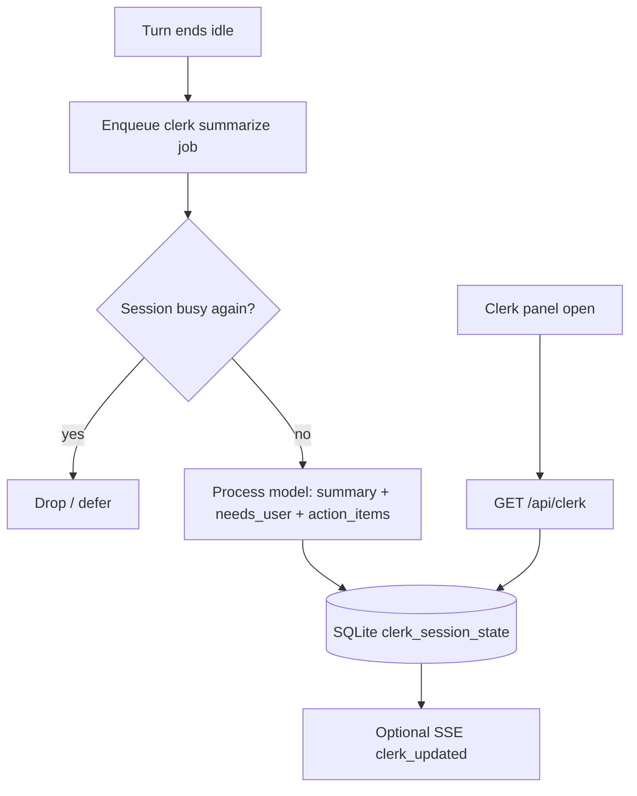

# ADR-0023: Clerk — Session Attention Dashboard

| Field | Value |
|-------|--------|
| **Status** | **Accepted** (ready to implement) |
| **Date** | 2026-08-03 |
| **Accepted** | 2026-08-03 |
| **Author** | — |
| **Deciders** | Project owner |
| **Tags** | clerk, dashboard, sessions, summary, action-items, UX, mobile |
| **Extends** | ADR-0001 (harness loop), ADR-0003 (SQLite), ADR-0005 (tools/loop), ADR-0008 (session info), ADR-0010 (turn transparency / busy), ADR-0013 (system prompt / soul), ADR-0018 (models), session title auto-update (last message / `title_custom`) |
| **Answers** | `adr/0023-answers.json` (`2026-08-03T08:06:16.955Z`) — all Q1–Q12 locked |
| **Review UI** | [0023-review.html](0023-review.html) |

## Overview

Operators run **many parallel Marble sessions**. The session list shows a truncated title (now last user message unless renamed) and metadata, but does **not** surface:

- which idle sessions are **waiting on a human decision**
- a **short summary** of what the agent last concluded
- **action items** extracted for the user
- a single **dashboard** sorted so the longest-idle, attention-needing work floats up

**Clerk** is a first-class attention surface: an icon next to the Marble logo (desktop and mobile) that opens an interactive **session wizard / dashboard**. It is the place the user returns to after diving in and out of sessions so they always pick the next human-attention item efficiently.

### Product story (example)

Five sessions:

| Order (longest idle first among idle) | Status | Clerk line | Icon |
|---------------------------------------|--------|------------|------|
| 1 | Idle, **needs user action** | “foo or bar?” | user-action |
| 2 | Idle, no action required | “foo done” | idle |
| 3–5 | Working | snippet of last **user** message (same spirit as session titles) | spinner / active |

Working sessions are **not** LLM-summarized while busy—only a cheap title-style snippet of the user’s last message. Idle sessions get continuous summaries (default process model) plus optional action-item extraction.

## Background & Motivation

### Current state

| Surface | What it shows |
|---------|----------------|
| Session list | Title, id, msg count, time, system/cron flags |
| Session header | Title · id, model picker, status pill (idle / running / iter) |
| Turn progress | Live phase inside an open session |
| Session info | Deep metadata for one session |

### Pain

1. Many sessions → hard to know **which idle thread needs a reply first**.  
2. Agent “ended with a question” looks the same as “ended with a status dump.”  
3. Diving into every session to re-read the last assistant message is slow on mobile.  
4. Titles track last **user** message, not last **agent ask**.

### Non-goals (v1)

| Non-goal | Rationale |
|----------|-----------|
| Full second product / separate app | Clerk is a panel in the existing harness UI |
| Summarizing **working** sessions with the LLM | Cost + churn; user said snippet only |
| Auto-jumping or auto-replying | User remains in control |
| Replacing session list or titles | Complementary surface |
| Perfect multi-user team inbox | Single operator / allowlist auth as today |
| Summarizing system-agent sessions as first-class rows | Default **hide** system sessions (open Q) |

## Goals

1. **Entry point:** icon beside the Marble logo on **desktop and mobile** opens Clerk.  
2. **Roster:** all (or filtered) **user** sessions with:
   - continuous **idle summary** (LLM, default process model)
   - **busy** vs **idle**
   - **needs user action** vs not (when idle)
   - last-user-message **snippet** for busy sessions (and as fallback)
   - extracted **action items** when idle and applicable  
3. **Sort:** longest **idle** first (among idle / action-needed); working sessions after or in a separate group (**Q2**).  
4. **Deep link:** each row jumps into that session.  
5. **Cheap + correct:** no LLM traffic for busy sessions’ activity feed; only re-summarize on meaningful idle transitions.  
6. **Durable enough** to survive harness restart (SQLite) without requiring the user to re-open every session.

## Key product rules (from operator intent)

| Rule | Spec |
|------|------|
| **R1 Working** | Show active/spinner; line = last **user** message snippet (title-like). **No** LLM summary of tool thrash. |
| **R2 Idle + decision** | User-action icon; short summary of the choice (e.g. “foo or bar?”); link to session. |
| **R3 Idle + done** | Idle icon; short “done” / status line (e.g. “foo done”). |
| **R4 Sort** | Longest idle first among sessions that need human attention / are idle. |
| **R5 Summarizer model** | Default process model (same as `--model` / process catalog entry) unless overridden (**Q5**). |
| **R6 Continuous** | Summaries refresh when a turn ends idle—not only on Clerk open. |

## Proposed design

### 1. Entry UX

| Element | Behavior |
|---------|----------|
| Icon | Next to logo in `.brand` / sidebar head (desktop + mobile). Suggested glyph: clipboard / desk / “clerk” mark — final icon **Q1**. |
| Panel | Modal or full-height drawer (mobile-first drawer recommended). Title: **Clerk**. |
| Empty | “No sessions yet” / “All quiet.” |
| Close | Esc, backdrop, × |

### 2. Row model (API + UI)

```text
ClerkSessionRow {
  session_id
  title                 // current session title (custom or last-user)
  kind                  // user | system (filter)
  status                // active | closed
  busy                  // live
  attention             // working | idle | needs_user
  idle_since            // RFC3339 when last turn became non-busy; null if busy
  idle_for_sec
  last_user_snippet     // truncated last user message
  summary               // LLM one-liner / short paragraph when idle; empty if working
  action_items[]        // strings; may be empty
  summary_updated_at
  jump_url              // /s/{id}
}
```

**Attention classification (proposal):**

| `attention` | When |
|-------------|------|
| `working` | `busy == true` |
| `needs_user` | idle **and** summarizer marked `needs_user` / non-empty action_items that are questions, **or** heuristic fallback (**Q6**) |
| `idle` | idle and not needs_user |

### 3. Sort order (proposal — **Q2**)

1. `needs_user` ordered by **longest idle first**  
2. `idle` ordered by longest idle first  
3. `working` ordered by most recently updated (or longest running — **Q2b**)  
4. Closed sessions: hide by default; optional toggle (**Q3**)

### 4. Summarization pipeline



**Trigger (R6):** when a user session’s turn ends with `busy → false` (normal complete, error, stop, hard wall / auto-continue edge cases: **Q7**).

**Do not trigger** on every tool step.

**Working sessions:** never call summarizer; row uses live `busy` + `last_user_snippet` only.

**Prompt sketch (idle only):**

```text
You maintain a short operator dashboard entry for one Marble session.
Given recent transcript (last N messages or post-compact tail):
Return JSON:
{
  "summary": "≤120 chars, plain language",
  "needs_user": true|false,
  "action_items": ["…"]  // empty if none; prefer questions the human must answer
}
Rules:
- needs_user=true if the agent is waiting on a choice, approval, OTP, missing input, or explicit question.
- needs_user=false if the agent delivered a status/report with nothing to decide.
- summary for needs_user should state the decision crisply ("foo or bar?").
- summary for idle done should be outcome-oriented ("foo done").
```

**Context window for summarizer:** last K UI messages or last assistant + last user + last tool errors (**Q8**). Prefer small prompts.

**Concurrency:** one summarizer job at a time globally, or per-session queue (**Q9**)—avoid stampedes when many sessions go idle.

**Failure:** keep previous summary; mark `summary_stale`; never block endTurn.

### 5. Persistence (SQLite)

New table (schema v6 sketch):

```sql
CREATE TABLE clerk_session_state (
  session_id TEXT PRIMARY KEY,
  summary TEXT NOT NULL DEFAULT '',
  needs_user INTEGER NOT NULL DEFAULT 0,
  action_items_json TEXT NOT NULL DEFAULT '[]',
  last_user_snippet TEXT NOT NULL DEFAULT '',
  idle_since TEXT,              -- RFC3339 or NULL if busy unknown
  summary_updated_at TEXT,
  summary_model TEXT,
  summary_error TEXT,
  FOREIGN KEY(session_id) REFERENCES sessions(id) ON DELETE CASCADE
);
```

Live `busy` always from session registry, not SQLite.

Optional: store `idle_since` only when transitioning busy→idle; clear when busy.

### 6. API

| Method | Path | Purpose |
|--------|------|---------|
| `GET` | `/api/clerk` | Full roster for UI (sorted) |
| `POST` | `/api/clerk/refresh` | Optional force re-summarize one or all idle (**Q10**) |
| SSE | existing session events + optional `clerk` event type on summary update | Live dashboard while open |

Auth: same as other `/api/*` (open or Google allowlist).

### 7. Integration points in harness

| Hook | Action |
|------|--------|
| `endTurn` / finalize progress when `busy` clears | Update `idle_since`, `last_user_snippet`; enqueue summarize if user session |
| `tryBeginTurn` / busy true | Clear needs_user display as working; cancel pending summarize for that id |
| User message | Refresh `last_user_snippet` (even if still busy) |
| Session close | Remove or hide from Clerk (**Q3**) |
| Session rename | Title in Clerk follows `title` / `title_custom` |

### 8. UI sketch

```text
┌ Clerk                              ✕ ┐
│ Sort: needs you · idle · working     │
│                                      │
│ ⚠ 0wc7…  12m idle                    │
│    foo or bar?                       │
│    • Confirm option foo or bar       │
│    [Open]                            │
│                                      │
│ ○ 0wc75…  4m idle                    │
│    foo done                          │
│    [Open]                            │
│                                      │
│ ◌ 0wc5…   working                    │
│    "Build Princess Dance store…"     │
│    [Open]                            │
└──────────────────────────────────────┘
```

Mobile: full-screen sheet; large Open buttons; same logo-adjacent icon (logo-only mobile brand remains).

### 9. Relationship to existing features

| Feature | Relationship |
|---------|----------------|
| Session list | Unchanged; Clerk is the attention dashboard |
| Auto title (last user msg) | Supplies busy-row snippets; Clerk idle summary is separate |
| `session_compact` | Clerk summarizer uses tail of transcript; compact still reduces cost |
| System agents | Default exclude from Clerk (**Q4**) |
| Cron sessions | Include if user-facing; badge optional |

## Alternatives considered

| Alternative | Why not default |
|-------------|-----------------|
| Only enhance session list rows | Too cramped on mobile; no action-item space |
| Summarize every N minutes always | Waste; thrash on long tool loops |
| Summarize working sessions | Operator explicitly rejected |
| Client-only JS summaries | Needs model; must be server-side |
| Separate “inbox” DB product | Overkill for v1 |

## Locked decisions (Q1–Q12 · 2026-08-03T08:06:16.955Z)

| # | Decision | Source |
|---|----------|--------|
| **KD1** | Entry: clipboard / desk-clerk glyph next to logo; `aria-label` / title **Clerk — session dashboard** | **Q1** |
| **KD2** | Sort: `needs_user` (longest idle first) → `idle` (longest idle first) → `working` (most recently updated first) | **Q2** |
| **KD3** | Closed sessions hidden by default; optional **Show closed** in Clerk header | **Q3** |
| **KD4** | Exclude **system-agent** sessions entirely in v1 | **Q4** |
| **KD5** | Summarizer always **process default** model; no per-session override in v1 | **Q5** |
| **KD6** | `needs_user`: LLM flag primary; fallback if LLM fails: last assistant ends with `?` or choose/option/confirm language | **Q6** |
| **KD7** | Summarize on **any** busy→idle: complete, error, stop, timeout | **Q7** |
| **KD8** | Summarizer input: last ~**12** UI messages or ~**8k** chars; prefer last user + last assistant + recent tool errors; skip image bytes | **Q8** |
| **KD9** | Global queue: **one** summarizer at a time; coalesce per session (latest idle wins); drop if session busy again | **Q9** |
| **KD10** | Manual **Refresh** (rate-limited) for idle rows; auto path remains primary | **Q10** |
| **KD11** | Mobile: **full-screen sheet**. Desktop: **modal or right drawer**. No separate `/clerk` route in v1 | **Q11** |
| **KD12** | Live updates while open: **poll** `GET /api/clerk` every **3–5s**; optional SSE if easy; poll-only OK for v1 | **Q12** |

No open questions remain for v1.

## Implementation plan (after answers)

| PR | Scope |
|----|--------|
| **C0** | Schema `clerk_session_state` + repository |
| **C1** | Hooks on busy transitions + last_user_snippet |
| **C2** | Summarizer worker + process model client |
| **C3** | `GET /api/clerk` sorted roster |
| **C4** | UI icon + panel + row components (desktop/mobile) |
| **C5** | SSE/poll live updates + jump links |
| **C6** | Force refresh, closed toggle, polish |

## Success metrics

| Signal | Target |
|--------|--------|
| Time-to-find “session waiting on me” | Seconds via Clerk vs scanning list |
| Summarizer calls while session busy | ~0 |
| False needs_user rate | Low enough that icons stay trusted |
| Mobile usability | One-thumb Open to correct session |

## Security & cost

- Summaries may include sensitive trip/cloud content—same trust boundary as session MD.  
- Bound summarizer max tokens and rate.  
- Do not send full screenshot blobs into summarizer by default.

## Changelog

| Date | Note |
|------|------|
| 2026-08-03 | Proposed — Clerk attention dashboard from operator product description |
| 2026-08-03 | **Accepted** — all Q1–Q12 locked; KD1–KD12 written; ready to implement C0→C6 |
